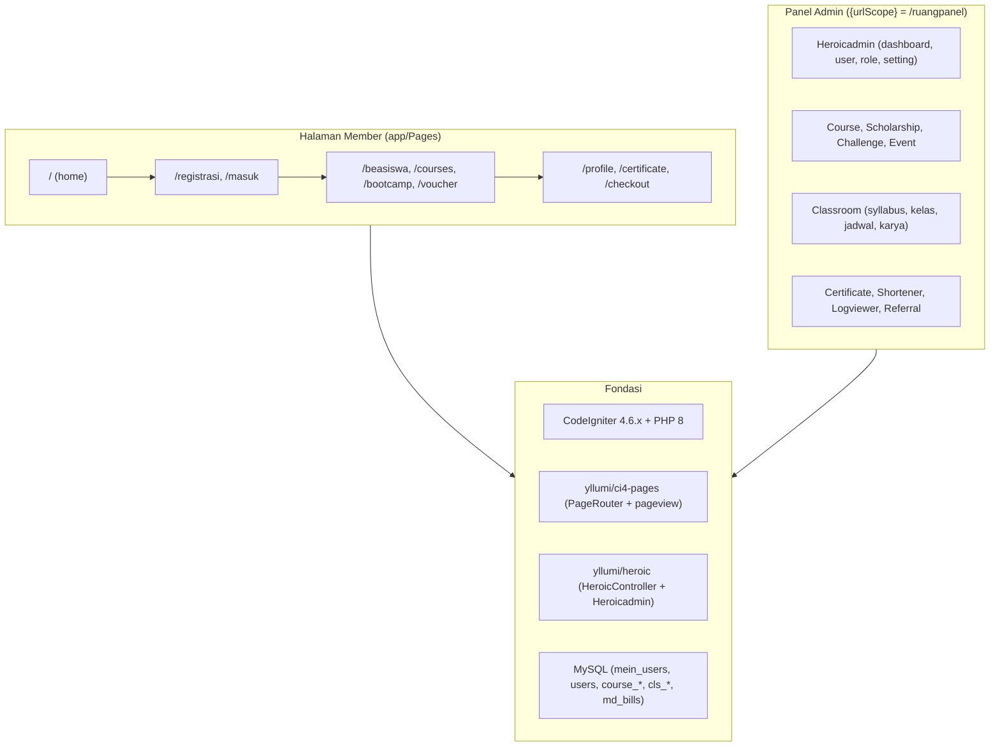
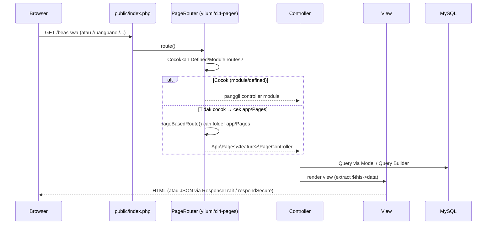
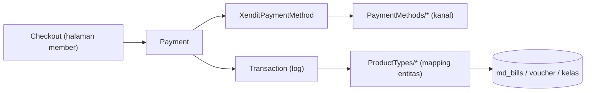

# RuangAI — Arsitektur Aplikasi

> Dokumen arsitektur tingkat tinggi untuk project **RuangAI** (platform web berbasis **CodeIgniter 4**).
> Disusun dari observasi langsung kode sumber (status: terverifikasi, 2026-08-20).
> Bacaan pendukung: `.github/copilot-instructions.md`, `SPEC-BOOTCAMP.md`, `SCHOLARSHIP_COMPETITION_HANDLING.md`.

---

## 1. Gambaran Umum

RuangAI adalah platform keanggotaan (member) yang menaungi beberapa produk:

- **Beasiswa / Scholarship** — program pendaftaran, referral, reward token, live meeting, kelulusan, klaim sertifikat.
- **Online Course / E-Learning** — course video, topic & lesson, live session (Zoom/Bunny), absensi, produk & voucher.
- **Bootcamp / Classroom** — silabus, materi, resource belajar, kelas, jadwal, submission, feedback, sertifikat, karya member.
- **Challenge** — challenge alibaba, submission, import.
- **Lainnya** — referral, event, shortener URL, sertifikat digital, reward token, web push.

Aplikasi memiliki **dua lapisan UI** yang saling berbagi tabel:

1. **Halaman member** — `app/Pages/` (SSR + Alpine.js/Tailwind, tema `public/mobilekit/`).
2. **Panel admin** — `modules/Heroicadmin/` + modul bisnis (tema `public/admin/`), berprefix `{urlScope}` (default `/ruangpanel`).



---

## 2. Stack Teknologi

| Aspek | Teknologi |
|-------|-----------|
| Bahasa | PHP ^8.1 (platform composer `8.3.30`) |
| Framework | CodeIgniter 4.6.x (`codeigniter4/framework`) |
| Database | MySQL (driver `MySQLi`), database `ruangai`, timezone `Asia/Jakarta` |
| ORM / DB | `CodeIgniter\Model` + Query Builder; migrasi CI4 (`spark migrate`) |
| Frontend member | Raw PHP view + Tailwind CSS (CDN) + Alpine.js 3 (CDN); tema **MobileKit** (`public/mobilekit/`) |
| Frontend admin | Bootstrap 5 + jQuery + DataTables + Alpine.js + Select2 + TinyMCE + datepicker; tema di `public/admin/` |
| Queue | **Beanstalkd** via `pda/pheanstalk` (worker `app/Commands/ProcessWaQueue.php`) |
| Email | **PHPMailer** (`app/Libraries/EmailSender.php`) |
| Web Push | `minishlink/web-push` (`app/Libraries/WebPush.php`) |
| Auth | Admin: session web (`user_id()`, `role_slug`); Member: session/token (`getUserFromToken()`), JWT `firebase/php-jwt` |
| Pembayaran | Xendit (`XenditPaymentMethod`) + 25+ kanal `app/Libraries/PaymentMethods/` |
| Lainnya | `endroid/qr-code`, `google/recaptcha`, `guzzlehttp/guzzle`, `matthiasmullie/minify`, `abordage/html-min`, `symfony/yaml`, `spatie/image-optimizer`, `codeigniter4/settings` |
| Deployment | **Deployer** (`deployer/deployer`, `deploy.php`, `builds/`) + **GitHub Actions** (`.github/workflows/deploy-main.yml`) |
| Testing | PHPUnit (`phpunit.xml.dist`, `tests/`) |
| Code style | `codeigniter/coding-standard`, `friendsofphp/php-cs-fixer`, `phpstan`, `composer-unused` |

---

## 3. Struktur Direktori

```
ruangai/
├── .github/
│   ├── copilot-instructions.md   # Panduan untuk GitHub Copilot (konvensi & batasan)
│   └── workflows/
│       └── deploy-main.yml       # Deploy otomatis ke main/dev (Deployer)
├── app/                      # Aplikasi inti
│   ├── Config/               # Konfigurasi CI4 + Routes + Autoload + Filters + Modules
│   ├── Controllers/          # Controller umum + Api/ (REST)
│   ├── Commands/             # CLI command (mis. ProcessWaQueue)
│   ├── Database/Migrations/  # Migrasi inti aplikasi (users, scholarship, voucher, regions, ...)
│   ├── Filters/              # AdminSession, HtmlMinifier, RequestLogger
│   ├── Helpers/              # ruangai_helper, scholarship_helper
│   ├── Libraries/            # Payment, Transaction, EmailSender, WebPush, FormBuilder, ...
│   ├── Models/               # Model inti (UserModel, Course, Scholarship, Checkout, ...)
│   ├── Pages/                # ★ Halaman member (page-based routing + Alpine.js)
│   ├── Validation/           # Aturan validasi khusus
│   └── Views/                # View umum
├── modules/                  # ★ Modul (admin & domain)
│   ├── Heroicadmin/          # Kerangka panel admin (AdminController, layout, setting, user)
│   ├── Classroom/            # Bootcamp — silabus, materi, kelas, jadwal, submission, karya
│   ├── Course/               # E-Learning — course, topic, lesson, live batch, produk
│   ├── Scholarship/          # Beasiswa — event, peserta, follow-up, referral
│   ├── Challenge/  Event/  Certificate/  Shortener/  Referral/  Logviewer/  Mahasiswi/
├── public/                   # Document root
│   ├── index.php             # Front controller
│   ├── admin/                # Aset tema admin (Bootstrap 5 / Mazer-style)
│   ├── mobilekit/            # Aset tema member (MobileKit)
│   ├── uploads/submissions/  # File tugas bootcamp
│   └── ... (certificates, pdf, fonts, startbootstrap, module-pdf)
├── vendor/                   # Dependencies (composer) — termasuk yllumi/ci4-pages, yllumi/heroic
├── writable/                 # cache, logs, session, debugbar
├── tests/                    # PHPUnit (unit, database, session, _support)
├── builds/  deploy.php       # Deployment (Deployer)
├── spark                     # CLI CI4
├── composer.json  phpunit.xml.dist  preload.php
├── ARCHITECTURE.md           # Dokumen ini
├── SPEC-BOOTCAMP.md          # Spesifikasi fitur bootcamp (referensi)
└── SCHOLARSHIP_COMPETITION_HANDLING.md  # Catatan handling user kompetisi vs beasiswa
```

---

## 4. Lapisan & Alur Request

### 4.1 Tiga Mekanisme Routing

Aplikasi menggabungkan **tiga mekanisme routing** sekaligus:

| Jenis | Lokasi | Keterangan |
|-------|--------|------------|
| **Defined routes** | `app/Config/Routes.php` | Route eksplisit umum + grup `/api/*` (namespace `App\Controllers\Api`). |
| **Module routes** | `modules/<Module>/Config/Routes.php` | Auto-discovery (Config\Modules `enabled=true`); grup `{urlScope}/<module>`. |
| **Page routes** | `app/Pages/Router.php` + `PageRouter` | Fallback: mencocokkan URI ke folder di `app/Pages/`. |

### 4.2 Alur Request End-to-End



---

## 5. Halaman Member — `app/Pages/`

### 5.1 Konsep "Page"

Setiap fitur member = satu folder di `app/Pages/<feature>/` berisi:

```
app/Pages/<feature>/
├── PageController.php   # Controller halaman (extends App\Pages\BaseController)
├── index.php            # view "shell"/daftar (opsional)
├── template.php         # view isi halaman (SSR + Alpine)
└── sub-folder/          # sub-halaman (masing-masing punya PageController + template)
```

- `PageController` extends `App\Pages\BaseController` → `Yllumi\Heroic\Controllers\HeroicController`
  (`vendor/yllumi/heroic/src/Controllers/HeroicController.php`).
- `getIndex()` merender **shell** (`app/Pages/layout.php`) via `pageView('layout', $data)`.
- `getTemplate()` merender **isi** halaman dari `template.php` (path diambil otomatis dari folder controller).
- `respondSecure()` — helper JSON yang memblokir origin beda-host & request non-AJAX di production.
- Data dinamis dimuat **Alpine.js** via `GET`/`POST` endpoint member.

Daftar halaman yang ada: `home`, `registrasi`, `masuk`, `reset_password`, `verify_email`,
`profile`, `voucher`, `certificate`, `beasiswa`, `scholarship`, `courses`, `bootcamp`,
`challenge`, `checkout`, `workshop`, `comentor`, `kajian`, `pustaka`, `feeds`, `pengumuman`,
`aktivasi`, `intro`, `webhook`, `webpush`, `sse`, `iuran`, `zpanel`, `page`, `notfound`, `offline`, `logout`, `keluar`, `prompt`, `masuk`.

### 5.2 `app/Pages/Router.php`

Array statis `Router::$router` memetakan URI → folder/`handler`:

```php
'/beasiswa' => ['preload' => true, 'handler' => '[isLoggedIn]'],
'/certificate/:code' => ['template' => '/certificate/detail/template'],
```

- `preload` — data disiapkan saat render shell.
- `handler` — penanda proteksi (mis. `[isLoggedIn]`).
- `template` — override path view isi.

### 5.3 Base Controller

- `App\Pages\BaseController` — set helper `pageview` (ci4-pages) & `heroic`, tema `mobilekit`,
  `$data['themeURL']` / `$data['themePath']`.
- `Yllumi\Heroic\Controllers\HeroicController` — `ResponseTrait`, `respondSecure()`, `getIndex`/`getTemplate`.

---

## 6. Panel Admin — `modules/Heroicadmin/`

### 6.1 Kerangka Admin

| Komponen | Lokasi | Fungsi |
|----------|--------|--------|
| Base controller | `Heroicadmin\Controllers\AdminController` | Auth session `user_id()`; blokir role `member`; load helper `heroicadmin` & `heroicsetting`. |
| Layout | `Heroicadmin\Views\_layouts\admin.php` | Shell Bootstrap 5 + jQuery + DataTables + Alpine + TinyMCE; render section `main`. |
| Partials | `_partials/` (`sidebar`, `header`, `footer`, `alerts`) | Kerangka UI. |
| Sidebar | `Heroicadmin\Cells\SidebarMenuCell` + `config('Heroicadmin')->sidebarMenu` | Menu dari konfigurasi (key `module`/`submodule`). |
| Sub-modul | `Modules/` (`Dashboard`, `User`, `Setting`, `Entry`) | Fitur inti admin. |
| Helper | `Heroicadmin\Helpers\` | `urlScope()`, `setting_item()` (dari `codeigniter4/settings`). |

### 6.2 Konfigurasi (`modules/Heroicadmin/Config/Heroicadmin.php`)

- `title` = `RuangAI`
- `urlScope` = `ruangpanel` (prefix semua route admin)
- `rootPanelUrl` = `dashboard`
- `sidebarMenu` = array menu (label, icon, module, submodule, url, children) — menu Dashboard,
  Shortener, Challenge, Certificate, User Management, Scholarship, E-Learning, Classroom, Products, ...

### 6.3 Route Admin (`modules/Heroicadmin/Config/Routes.php`)

- `/{scope}/dashboard` — dashboard + import CSV Alibaba.
- `/{scope}/setting` — pengaturan aplikasi (`Setting::save`).
- `/{scope}/user` — login/logout, manajemen user, role, reward token (generate, generate-by-email, import).

---

## 7. Modul Domain — `modules/<Module>/`

### 7.1 Konvensi Modul

Setiap modul bisnis mengikuti pola **Heroicadmin**:

```
modules/<Module>/
├── Config/
│   └── Routes.php           # grup {urlScope}/<module>; namespace 'Module\Controllers'
├── Controllers/             # extends Heroicadmin\Controllers\AdminController
├── Models/                  # extends CodeIgniter\Model
├── Views/                   # extends Heroicadmin\Views\_layouts\admin
├── Libraries/  Helpers/  Validation/   # (opsional)
└── Database/
    └── Migrations/          # migrasi tabel modul (auto-discovered)
```

### 7.2 Registrasi Modul

1. Tambah namespace ke `app/Config/Autoload.php` (`$psr4`). Namespace yang sudah terdaftar:
   `Heroicadmin`, `Course`, `Scholarship`, `Shortener`, `Certificate`, `Logviewer`, `Referral`,
   `Challenge`, `Mahasiswi`, `Event`, `Classroom`.
2. `Config/Routes.php` modul otomatis ter-discover (auto-discovery aktif).
3. Migrasi di `Database/Migrations/` otomatis ter-discover (jalankan `php spark migrate -n 'Nama'`).
4. (Opsional) Tambah menu di `sidebarMenu` `Heroicadmin.php`.

### 7.3 Modul yang Ada

| Modul | Namespace | Fungsi |
|-------|-----------|--------|
| `Heroicadmin` | `Heroicadmin` | Kerangka panel admin. |
| `Classroom` | `Classroom` | **Bootcamp**: silabus, materi, resource, kelas, jadwal, submission, feedback, karya (tabel `cls_*`). |
| `Course` | `Course` | E-Learning: course, topic, lesson (theory/quiz), live batch/meeting, absensi, produk. |
| `Scholarship` | `Scholarship` | Beasiswa: event, peserta, follow-up comentor, referral. |
| `Challenge` | `Challenge` | Challenge & submission. |
| `Certificate` | `Certificate` | Generate & kelola sertifikat digital. |
| `Shortener` | `Shortener` | URL shortener. |
| `Referral` | `Referral` | Manajemen referral. |
| `Event` · `Logviewer` · `Mahasiswi` | — | Event, log viewer, data mahasiswi. |

### 7.4 Contoh: Modul `Classroom` (Bootcamp, terverifikasi)

- Route group: `setting_item('Heroicadmin.urlScope') . '/classroom'` → `ruangpanel/classroom`.
- 8 controller: `Syllabus`, `Material`, `ClassRoom`, `Schedule`, `Member`, `Feed`, `Feedback`, `MemberWork`.
- 16 model + 8 migrasi (16 tabel `cls_*`).
- Alur kunci: silabus `draft→published` → kelas `draft→active→archived` → sync materi →
  set `scheduled_at` → `toggle-open` materi → peserta → review submission → klaim sertifikat.
- Referensi detail: `SPEC-BOOTCAMP.md`.

---

## 8. API (`/api/*`)

Didefinisikan di `app/Config/Routes.php` dengan namespace `App\Controllers\Api`
(controller di `app/Controllers/Api/`):

| Area | Controller | Endpoint |
|------|-----------|----------|
| Auth | `AuthController` | `auth/register`, `auth/login`, `auth/forgot-password`, `auth/reset-password`, `auth/send-otp`, `auth/send-otp-email`, `auth/verify-otp`, `auth/verify-otp-email`, `auth/check-referral-comentor` |
| Beasiswa | `ScholarshipController` | `scholarship` (GET/POST), `scholarship/settings`, `scholarship/live-meetings/nearest`, `scholarship/syncGraduatedB1`, `generateTokenUserGraduate`, `referral`, `leaderboard`, `program` |
| Challenge | `ChallengeController` | `challenge` (GET/POST), `challenge/statistics` |
| Profil | `UserController` | `user/profile/update` |
| Wilayah | `RegionController` | `regions/provinces`, `regions/cities/:p`, `regions/districts/:c`, `regions/villages/:d` |
| Web Push | `WebpushController` | `push/register`, `push/send`, `push/generate_vapid` |
| WA | `WASenderController` | `wasender`, `wasender/incoming` |
| Webhook | `WebhookController` | `webhook_feedback` (GET/POST) |

Catatan: sebagian route API memakai autentikasi **token Bearer/cookie** (`getUserFromToken()`),
sebagian publik. Karya member bootcamp juga punya endpoint API (`/api/member/works*` dan `/api/works` publik).

---

## 9. Database & Model

### 9.1 Konvensi

- Koneksi default `MySQLi`, database `ruangai`.
- Model extends `CodeIgniter\Model`; tabel **plural snake_case**; FK `{table}_id`.
- Migrasi CI4; namespace modul → `spark migrate -n 'Namespace'`.
- Model punya `$this->db`; controller **tidak** (perlu `\Config\Database::connect()`).

### 9.2 Kelompok Tabel Penting

| Kelompok | Tabel | Pemilik |
|----------|-------|---------|
| User member | `mein_users`, `anggota`, `user_profile` | Aplikasi inti |
| User admin | `users`, `roles` | Heroicadmin |
| E-Learning | `courses`, `course_*`, `live_*` | `Course` |
| Beasiswa | `scholarship*`, `*_participants`, `reward_token` | `Scholarship` |
| **Bootcamp** | `cls_*` (16 tabel) | `Classroom` |
| Sertifikat | `certificates` | `Certificate` |
| Pembayaran | `md_bills`, `payment_voucher_log`, `payment_*` | Libraries |
| Lainnya | `events`, `vouchers`, `regions`, `otp_whatsapp`, `push_subscriptions`, `feedback` | Aplikasi inti |

### 9.3 Migrasi Inti (`app/Database/Migrations/`)

`users`, `roles`, `scholarship_participants`, `otp_whatsapp`, `push_subscriptions`,
`user_profile`, `events`, `feedback`, `vouchers`, `regions`, `reward_token` — plus kolom tambahan
pada `users`/`scholarship` (referral, sponsorship, reference_comentor, source, dll).

---

## 10. Pembayaran & Transaksi

- **`app/Libraries/Payment.php`** + **`XenditPaymentMethod`** — integrasi utama (Xendit).
- **`app/Libraries/PaymentMethods/`** — 25+ kanal: QRIS, OVO, DANA, BCA, BCAKlikpay, BRI, BNI,
  Mandiri, BSI, Permata, CIMB, BJB, DDBRI, Transfer, Voucher, CashAuto/Manual, Shopeepay, Linkaja,
  Astrapay, Jeniuspay, Indomaret, Alfamart, Sampoerna, CreditCard, XenInvoice, dll.
- **`app/Libraries/Transaction.php`** — alur transaksi & log.
- **`app/Libraries/ProductTypes/`** — tipe produk (`BillProductType`, `BaseProductType`)
  untuk memetakan pembelian → entitas (mis. tagihan `md_bills`, voucher, kelas).



---

## 11. Library Inti (`app/Libraries/`)

| Library | Fungsi |
|---------|--------|
| `Auth`, `AuthSSR` | Autentikasi member (login, OTP, token). |
| `EmailSender` | Kirim email via PHPMailer; API `setTemplate($name, $data)` + `send($to, $subject)` (tidak ada `sendBySlug`). |
| `Phpass` | Hash password (portable PHP password hash). |
| `WebPush` | Web Push Notification (VAPID). |
| `Tenant` | Utilitas multi-tenant / konteks aplikasi. |
| `Heroic` | Utilitas paket `yllumi/heroic`. |
| `FormBuilder` / `FormFields` / `BaseField` | Generator form dinamis. |
| `Payment` / `Transaction` / `BasePaymentMethod` / `BaseProductType` | Pembayaran. |

---

## 12. Frontend

### 12.1 Tema Member — MobileKit (`public/mobilekit/`)

- Shell `app/Pages/layout.php` + `_appHeader.php` + `_bottommenu.php`.
- Komponen bersama di `app/Pages/_components/` (`card/`, `common/`, `scholarship_cta.php`).
- Data dinamis di browser: **Alpine.js 3** (CDN), fetch ke endpoint member.

### 12.2 Tema Admin (`public/admin/`)

- Bootstrap 5, jQuery, DataTables 1.13, Alpine.js, Select2, TinyMCE, datepicker, Ace Editor, tinyColorPicker.
- `app-ext.css` — kustomisasi tambahan.
- Datatable server-side: view mengirim `draw/start/length/search`, controller merespons JSON.

---

## 13. Autentikasi & Keamanan

- **Admin**: session `user_id()` + cek `role_slug` (bukan `member`) — ditangani `AdminController`; login di `/{urlScope}/user/login`.
- **Member**: session web / token (`getUserFromToken()`); OTP via WA/email; `Phpass` untuk hash password.
- **Filter** (`app/Config/Filters.php`):
  - `required`: `forcehttps`, `pagecache` (before); `pagecache`, `performance` (after).
  - `globals`: `invalidchars` (before), `htmlmin` (after).
  - `filters`: `adminsession` pada `zpanel`, `zpanel/*`.
- **Respond AJAX**: `respondSecure()` memblokir origin beda-host & non-AJAX di production (403).
- **Upload aman**: blacklist ekstensi berbahaya (`php`, `phar`, `sh`, `exe`), validasi `allowed_types` & `max_size_mb`; **anti path traversal** saat download file.

---

## 14. Queue & Background Jobs

- Driver: **Beanstalkd** (`pda/pheanstalk`).
- Worker: `app/Commands/ProcessWaQueue.php` (proses antrian WhatsApp, dijalankan via `spark`).
- Web push & email notifikasi dikirim dari controller (sinkron) atau via antrian.

---

## 15. Deployment & Testing

### 15.1 Deployer

- `deploy.php` (recipe `codeigniter4`) + direktori `builds/`.
- Host `main` → `ruangai.codepolitan.com`; host `dev` → `ruangai-staging.appdata.id`.
- Hook: `deploy:vendors` → `spark:migrate` → `spark:heroic:update` → `deploy:publish` → `spark:optimize`.

### 15.2 GitHub Actions (`.github/workflows/deploy-main.yml`)

- Trigger: push ke `main` / `dev` + `workflow_dispatch`.
- Steps: checkout → setup PHP 8.3 → `composer install` → ssh-agent (SSH_PRIVATE_KEY) →
  known_hosts → `php vendor/bin/dep deploy ${BRANCH_NAME}`.

### 15.3 Testing

- PHPUnit: `phpunit.xml.dist`, folder `tests/` (`unit/`, `database/`, `session/`, `_support/`).
- Jalankan: `composer test` / `vendor/bin/phpunit`.

---

## 16. Konvensi Penamaan

| Entitas | Aturan | Contoh |
|---------|--------|--------|
| Controller | Suffix `Controller` (admin) / `PageController` (member) | `Syllabus`, `ClassRoom`, `PageController` |
| Method controller | Admin: verb-plain (`index`, `store`, `data`) via route eksplisit; Member: `getIndex`, `getTemplate` | — |
| Model | Suffix `Model` | `SyllabusModel` |
| Tabel | plural snake_case, prefix domain | `cls_syllabuses`, `course_lessons` |
| FK | `{table}_id` | `syllabus_id`, `class_id` |
| Route grup | `{urlScope}/<module>` | `ruangpanel/classroom` |
| UI Language | Bahasa Indonesia | — |

---

## 17. Panduan Praktis

### Membuat modul admin baru

1. `modules/<Nama>/` dengan `Config/Routes.php`, `Controllers/`, `Models/`, `Views/`, `Database/Migrations/`.
2. Daftarkan namespace di `app/Config/Autoload.php` (`$psr4`).
3. Tambah menu di `modules/Heroicadmin/Config/Heroicadmin.php` (`sidebarMenu`).
4. Controller extends `AdminController`; deklarasikan `protected $db;` + `\Config\Database::connect()` di constructor bila perlu.
5. View extends layout `admin`; jalankan migrasi `php spark migrate -n 'Nama'`.

### Membuat halaman member baru

1. Folder `app/Pages/<fitur>/` dengan `PageController.php` + `template.php`.
2. Daftarkan route di `app/Pages/Router.php` (`Router::$router`).
3. `PageController extends App\Pages\BaseController`; `getIndex()` → shell, `getTemplate()` → isi.
4. Endpoint AJAX member → gunakan `respondSecure()`.

### Perintah CLI

```bash
php spark serve                  # dev server
php spark migrate -n 'Classroom' # migrasi per namespace
php spark migrate:status         # status migrasi
php spark routes                 # daftar route
php spark ProcessWaQueue         # worker antrian WA
composer test                    # jalankan PHPUnit
vendor/bin/php-cs-fixer fix      # code style (CodeIgniter standard)
php vendor/bin/dep deploy main|dev  # deploy Deployer
```

---

## 18. Catatan Arsitektur yang Perlu Diingat

1. **Controller tidak punya `$this->db`** — deklarasikan `protected $db;` + `\Config\Database::connect()` di constructor; Model sudah punya.
2. **Tabel member = `mein_users`** (bukan `users`); tabel `users` dipakai admin. Tidak ada kolom email yang terverifikasi — cari member via username/phone/email secara defensif.
3. **Migrasi semua-namespace bisa gagal** karena migrasi App lama yang pending/rusak (`2025-12-30-070448_AddSourceToUsers`); gunakan `php spark migrate -n 'Namespace'`.
4. **`EmailSender` tidak punya `sendBySlug`** — pakai `setTemplate()` + `send()`.
5. **Halaman member vs modul admin** membaca/menulis tabel yang sama (mis. bootcamp: `app/Pages/bootcamp/` member, `modules/Classroom/` admin — tabel `cls_*`). Jaga konsistensi logika di kedua sisi.
6. **Modul baru** wajib didaftarkan namespace-nya agar route & migrasi auto-discovery bekerja.
7. **UI copy** seluruhnya Bahasa Indonesia.
