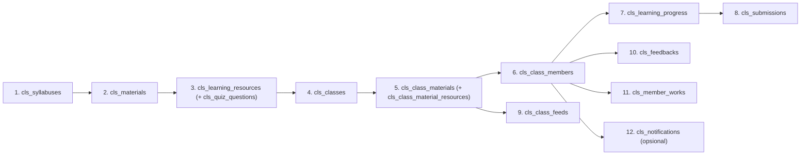

# PLAN — Bootcamp / Classroom: Seeding Data & Roadmap Halaman Member

> Dokumen **rencana** (belum eksekusi) untuk fitur **Bootcamp / Classroom**.
> Basis: `SPEC-BOOTCAMP.md` (admin) & `SPEC-BOOTCAMP-MEMBER.md` (member) + observasi kode aktual (2026-08-31).
> Disusun dari hasil diskusi: **seeding data via skrip SQL** + **roadmap halaman member**, skenario **minimal**.

---

## 1. Status Saat Ini (verifikasi)

| Area | Status | Keterangan |
|------|--------|------------|
| Migrasi `Classroom` | ✅ Selesai | 8 migrasi → 16 tabel `cls_*` sudah dibuat, **data kosong** |
| **Seeding data** | ✅ **Sudah dieksekusi (2026-08-31)** | `database/seed/classroom_bootcamp.sql` berhasil dijalankan; semua tabel `cls_*` terisi |
| Modul admin | ✅ Lengkap | `modules/Classroom/` — 8 controller, 16 model, routes, views |
| Referensi tabel user | ✅ **Disesuaikan** | DB ini **tidak punya `mein_users`**; member & admin ada di `users` (role_id: 1=Super, 2=Member, 3=Admin, 4=CO-Mentor). Referensi `mein_users` → `users` sudah diubah di 6 file modul Classroom |
| Halaman member | ❌ **Belum ada** | Folder `app/Pages/bootcamp/` tidak ada; `Router.php` belum punya route `/bootcamp` |
| Template sertifikat bootcamp | ❌ **Belum ada** | `BootcampVibeCodingCertificateTemplate` tidak ditemukan di `modules/Certificate/Libraries/` |
| Redeem voucher `classroom` | ❌ Belum ada | `CourseVoucherModel::claimVoucher()` hanya support `object_type='course'` |

## 1b. Hasil Eksekusi (2026-08-31)

- Seed dijalankan ke DB `app_ruangai_prod_06_26` dengan `ADMIN_ID=1` (Aldiansyah Ibrahim) & `MEMBER_ID=2` (Novan Junaedi).
- Semua tabel terisi: syllabuses=1, materials=2, learning_resources=6, quiz_questions=2, classes=1, class_materials=2, class_material_resources=1, class_members=1, learning_progress=4, submissions=1, class_feeds=1, feedbacks=1, member_works=1, notifications=1.
- **Fix schema:** `mein_users` → `users` diterapkan di `MemberWork.php`, `Schedule.php`, `ClassMemberModel.php`, `FeedbackModel.php`, `MemberWorkModel.php`, `SubmissionModel.php` (+ README). Query member/karya/feedback/submission terverifikasi jalan.
- **Halaman member DIBANGUN** (2026-08-31): `app/Pages/bootcamp/` — Kelas Saya (`/bootcamp`), **Intro Bootcamp** (`/bootcamp/classes/{id}/intro`), Belajar 4 tab (`/bootcamp/classes/{id}/learn`), Karya (`/bootcamp/works`), + redeem voucher `/bootcamp/redeem`. Alur: Mulai Belajar → Intro → Learn. Semua endpoint GET/POST terverifikasi via route test + uji browser.
- **Template sertifikat bootcamp dibuat:** `BootcampVibeCodingCertificateTemplate` (prefix `BC`) + didaftarkan di `Certificate\Config\Certificate::$availableTemplates['bootcamp']`.
- **Voucher uji:** `BC-BATCH1` (classroom, kelas id 1, owner Novan) ditambahkan untuk test redeem.
- **Menunggu:** landing page publik karya (`/api/works`), pengerjaan kuis member (masih gap).

**Kesimpulan:** Seed data selesai, modul admin & halaman member sudah terisi/terbangun. Sisa pekerjaan opsional: API publik karya (`/api/works`) dan pengerjaan kuis member.

---

## 2. Tujuan

1. **Seed data minimal** ke 16 tabel `cls_*` agar modul admin `/ruangpanel/classroom/*` bisa diuji end-to-end (silabus → materi → resource → kelas → jadwal → peserta → submission → feed → feedback → karya).
2. Menyiapkan **fondasi data yang sama** untuk halaman member (saat nanti dibangun).
3. Menyediakan **roadmap implementasi halaman member** `app/Pages/bootcamp/`.

## 3. Keputusan yang Disepakati

- **Scope:** seeding data + roadmap halaman member (bukan eksekusi kode halaman member sekarang).
- **Metode seeding:** skrip **SQL raw** (file `.sql`), bukan CI4 Seeder.
- **Data referensi:** user sudah ada → skrip memakai **placeholder ID** (`:ADMIN_ID:`, `:MEMBER_ID:`) yang diisi manual.
- **Volume data:** **minimal** — 1 silabus published, 2 materi, 5–6 resource, 1 kelas `active`, 2 jadwal materi, 1 member, progres + submission, 1 feed, 1 feedback, 1 karya.

---

## 4. Prasyarat

1. DB `app_ruangai_prod_06_26` (MySQL) bisa diakses.
2. Migrasi Classroom terdaftar — cek status:
   ```bash
   php spark migrate:status   # pastikan 8 migrasi namespace Classroom tercatat
   ```
3. Siapkan ID user yang sudah ada:
   - **`:ADMIN_ID:`** — id di tabel `users` (dipakai `created_by`, `instructor_id`, `reviewed_by`, `created_by` feed).
   - **`:MEMBER_ID:`** — id di tabel `mein_users` (dipakai `user_id` peserta / pemilik karya).
   ```sql
   SELECT id, name, email FROM users WHERE id = :ADMIN_ID:;
   SELECT id, name, username, phone FROM mein_users WHERE id = :MEMBER_ID:;
   ```
4. (Opsional untuk test klaim sertifikat) Tabel `certificates` & `certificate_templates` sudah ada dari migrasi modul `Certificate`.

---

## 5. Strategi Seeding (Skrip SQL)

- **File:** `database/seed/classroom_bootcamp.sql` (buat folder `database/seed/` di root bila belum ada).
- **Cara menjalankan:**
  ```bash
  mysql -u USER -p ruangai < database/seed/classroom_bootcamp.sql
  ```
- **Idempotent:** seluruh isi dibungkus `START TRANSACTION` … `COMMIT`; di awal, hapus data seed dengan ID tetap (urut terbalik dari FK) agar bisa diulang tanpa duplikat:
  ```sql
  DELETE FROM cls_member_works        WHERE id IN (1);
  DELETE FROM cls_feedbacks           WHERE id IN (1);
  DELETE FROM cls_class_feeds         WHERE id IN (1);
  DELETE FROM cls_submissions         WHERE id IN (1);
  DELETE FROM cls_learning_progress   WHERE id IN (1,2,3,4);
  DELETE FROM cls_class_members       WHERE id IN (1);
  DELETE FROM cls_class_material_resources WHERE id IN (1);
  DELETE FROM cls_class_materials     WHERE id IN (1,2);
  DELETE FROM cls_classes             WHERE id IN (1);
  DELETE FROM cls_quiz_questions      WHERE id IN (1,2);
  DELETE FROM cls_learning_resources  WHERE id IN (1,2,3,4,5,6);
  DELETE FROM cls_materials           WHERE id IN (1,2);
  DELETE FROM cls_syllabuses          WHERE id IN (1);
  ```
- **Gunakan ID eksplisit** (fixed) bukan `AUTO_INCREMENT`, agar FK antar tabel mudah dirujuk.
- **JSON `content`** disimpan sebagai string JSON valid (kolom `TEXT`).

### Urutan Insert (dependency order)



> Alasan urutan: setiap tabel hanya boleh insert setelah FK parent-nya ada. `cls_class_materials` butuh `cls_classes` + `cls_materials`. `cls_learning_progress` butuh `cls_class_materials` + `cls_learning_resources` + member.

---

## 6. Detail Data Seed (Minimal) — Isi Skrip

### 6.1 Master Konten

**`cls_syllabuses` — 1 silabus `published`**

```sql
INSERT INTO cls_syllabuses (id, name, subtitle, description, status, created_by)
VALUES (1, 'Bootcamp Vibe Coding', 'Dasar-dasar Pengembangan Web untuk Pemula',
        'Bootcamp intensif belajar HTML, CSS, dan JavaScript lewat praktik membangun proyek nyata.',
        'published', :ADMIN_ID:);
```

**`cls_materials` — 2 materi**

```sql
INSERT INTO cls_materials (id, syllabus_id, title, subtitle, description, order_seq, weight, scoring_type)
VALUES
  (1, 1, 'Pengenalan & Setup Lingkungan', 'Minggu 1', 'Setup tools, struktur proyek, dan kontrak belajar.', 1, 0, 'auto'),
  (2, 1, 'Proyek Akhir: Landing Page', 'Minggu 2', 'Membangun landing page portofolio dari nol.', 2, 0, 'manual');
```

**`cls_learning_resources` — resource tiap materi (6 baris, mewakili tipe utama)**

```sql
INSERT INTO cls_learning_resources
(id, material_id, type, title, content, order_seq, completion_criteria, is_required, need_review)
VALUES
  -- Materi 1
  (1, 1, 'text', 'Selamat Datang di Bootcamp',
   '{"html":"<p>Selamat datang! Pelajari alur belajar dan aturan kelas pada halaman ini.</p>","instructions":"Baca sampai selesai lalu klik Saya Sudah Paham."}',
   1, 'view', 1, 0),
  (2, 1, 'video', 'Tutorial Setup Tools',
   '{"url":"https://www.youtube.com/watch?v=dQw4w9WgXcQ","platform":"youtube","duration":"00:12:30","instructions":"Tonton video lalu tandai selesai."}',
   2, 'view', 1, 0),
  (3, 1, 'meeting', 'Sesi Live: Kickoff',
   '{"description":"Perkenalan instruktur, roadmap materi, dan sesi tanya jawab.","duration":90,"mode":"offline_online","instructions":"Hadir sesuai jadwal; link menyusul via grup WA."}',
   3, 'view', 0, 0),
  -- Materi 2
  (4, 2, 'submission', 'Tugas: Submit Landing Page',
   '{"submission_type":"upload","instructions":"Upload file project (zip) atau link hasil deploy.","deadline_offset_days":7,"allowed_types":"pdf,zip,docx","max_size_mb":10}',
   1, 'submit', 1, 1),
  (5, 2, 'url', 'Referensi: Contoh Proyek',
   '{"url":"https://example.com/contoh-proyek","open_in":"tab","instructions":"Buka tautan sebagai referensi desain."}',
   2, 'view', 0, 0),
  (6, 2, 'quiz', 'Kuis Evaluasi Materi',
   '{"pass_score":70,"time_limit_minutes":10,"max_attempts":2,"instructions":"Jawab kuis untuk menguji pemahaman (opsional, menunggu fitur member)."}',
   3, 'score_pass', 1, 0);
```

**`cls_quiz_questions` — 2 soal (opsional, untuk data kuis)**

```sql
INSERT INTO cls_quiz_questions (id, resource_id, question, type, options, correct_answer, score, order_seq)
VALUES
  (1, 6, 'Apa kepanjangan dari HTML?', 'multiple_choice',
   '[{"label":"HyperText Markup Language","value":"a"},{"label":"HighText Machine Language","value":"b"},{"label":"HyperTool Markup Language","value":"c"}]',
   'a', 50, 1),
  (2, 6, 'Tag mana yang digunakan untuk judul utama?', 'multiple_choice',
   '[{"label":"<h1>","value":"a"},{"label":"<head>","value":"b"},{"label":"<p>","value":"c"}]',
   'a', 50, 2);
```

### 6.2 Kelas & Keanggotaan

**`cls_classes` — 1 kelas `active` (siap klaim sertifikat)**

```sql
INSERT INTO cls_classes
(id, syllabus_id, name, thumbnail, description, status, start_date, whatsapp_group_url,
 certificate_requirement, required_feedback_before_claim_certificate, certificate_claimable, created_by)
VALUES
  (1, 1, 'Bootcamp Vibe Coding — Batch 1',
   'https://example.com/thumbnail-bootcamp.png',
   'Batch pertama bootcamp vibe coding. Peserta aktif terdaftar.',
   'active', '2026-09-01', 'https://chat.whatsapp.com/xxxxx',
   '4',                       -- CSV id resource submission yang wajib selesai (resource id=4)
   1,                         -- wajib isi feedback sebelum klaim
   1,                         -- certificate_claimable = 1 (gate klaim aktif)
   :ADMIN_ID:);
```

> `certificate_requirement='4'` = resource submission id 4 harus `completed` sebelum klaim.

**`cls_class_materials` — 2 jadwal materi (1 dibuka, 1 terkunci)**

```sql
INSERT INTO cls_class_materials
(id, class_id, material_id, instructor_id, scheduled_at, is_open, opened_at, notes)
VALUES
  (1, 1, 1, :ADMIN_ID:, '2026-09-01 19:00:00', 1, '2026-09-01 19:00:00', 'Sesi pembukaan + setup.'),
  (2, 1, 2, :ADMIN_ID:, '2026-09-15 19:00:00', 0, NULL, 'Proyek akhir, dibuka setelah sesi 1 selesai.');
```

**`cls_class_material_resources` — metadata meeting materi 1 (opsional)**

```sql
INSERT INTO cls_class_material_resources (id, class_id, material_id, resource_id, metadata)
VALUES (1, 1, 1, 3,
        '{"instructor_name":"Nama Instruktur","zoom_link":"https://zoom.us/j/xxxxx","venue":"Online via Zoom","mode":"offline_online"}');
```

**`cls_class_members` — 1 member `active`**

```sql
INSERT INTO cls_class_members (id, class_id, user_id, role, status)
VALUES (1, 1, :MEMBER_ID:, 'member', 'active');
```

### 6.3 Progres, Submission

**`cls_learning_progress` — progres member (text & video selesai, tugas in_progress)**

```sql
INSERT INTO cls_learning_progress
(id, class_material_id, resource_id, user_id, status, completed_at)
VALUES
  (1, 1, 1, :MEMBER_ID:, 'completed', '2026-09-02 08:00:00'),
  (2, 1, 2, :MEMBER_ID:, 'completed', '2026-09-02 08:20:00'),
  (3, 1, 3, :MEMBER_ID:, 'not_started', NULL),
  (4, 2, 4, :MEMBER_ID:, 'in_progress', NULL);
```

**`cls_submissions` — 1 tugas status `submitted` (menunggu review)**

```sql
INSERT INTO cls_submissions (id, progress_id, type, url, submitted_at, status)
VALUES (1, 4, 'url', 'https://github.com/member/landing-page', '2026-09-16 09:00:00', 'submitted');
```

### 6.4 Feed, Feedback, Karya, Notifikasi

**`cls_class_feeds` — 1 pengumuman pinned**

```sql
INSERT INTO cls_class_feeds (id, class_id, title, body, pinned, created_by)
VALUES (1, 1, 'Selamat Datang Peserta Batch 1',
        'Silakan mulai dengan materi pertama dan kerjakan tugas di materi kedua. Selamat belajar!',
        1, :ADMIN_ID:);
```

**`cls_feedbacks` — 1 feedback member (syarat klaim sertifikat)**

```sql
INSERT INTO cls_feedbacks
(id, class_id, user_id, profession, city, condition_before, reason_choice, favorite_moment,
 rating, concrete_skill, message_to_friend, allow_testimonial)
VALUES
  (1, 1, :MEMBER_ID:, 'Mahasiswa', 'Jakarta', 'a',
   'Ingin belajar web development dari nol.', 'Sesi live kickoff dan feedback instruktur',
   5, 'Mampu membuat landing page responsif', 'Wajib ikut, materinya praktikal!', 1);
```

**`cls_member_works` — 1 karya `published`**

```sql
INSERT INTO cls_member_works
(id, user_id, title, thumbnail, photos, description, short_description, status, url_project)
VALUES
  (1, :MEMBER_ID:, 'Landing Page Portofolio',
   'https://example.com/thumb-portofolio.png',
   '["https://example.com/photo-1.png","https://example.com/photo-2.png"]',
   'Landing page portofolio pribadi hasil proyek akhir bootcamp. Dibangun dengan HTML & CSS murni.',
   'Landing page portofolio responsif', 'published',
   'https://github.com/member/landing-page');
```

**`cls_notifications` — opsional (tabel belum dikonsumsi kode)**

```sql
INSERT INTO cls_notifications (id, user_id, type, title, body)
VALUES (1, :MEMBER_ID:, 'class_feed', 'Pengumuman Kelas', 'Selamat datang di Bootcamp Vibe Coding — Batch 1.');
```

### 6.5 (Opsional) Voucher untuk alur Redeem

> ⚠️ **Catatan:** `CourseVoucherModel::claimVoucher()` saat ini hanya menerima `object_type='course'`. Untuk alur redeem member (`/bootcamp/redeem-voucher` → `product_type='classroom'`) logika baru **belum ada** — jadi seeding voucher ini baru berguna setelah halaman member & logika redeem dibangun. Boleh di-skip dulu.

```sql
INSERT INTO vouchers (object_id, object_type, voucher_code, name, email, phone)
VALUES (1, 'classroom', 'BC-BATCH1', 'Nama Member', 'member@example.com', '08123456789');
```

---

## 7. Verifikasi Setelah Seed

### 7.1 Admin Panel (`/ruangpanel/classroom`)

| Halaman | Cek |
|---------|-----|
| `/classroom/syllabuses` | 1 silabus `published`, kolom count materi = 2 |
| `/classroom/classes` | 1 kelas `active`; dropdown silabus berisi silabus id 1 |
| `/classroom/classes/1/schedule` | 2 materi ter-sync (`is_unsynced` = 0); toggle-open berfungsi di materi 1 |
| `.../schedule/1/progress` | Progres member terlihat (resource 1 & 2 completed) |
| `.../schedule/2/submissions` | 1 submission `submitted` siap direview (accept → progress jadi `completed`) |
| `/classroom/classes/1/members` | 1 member aktif |
| `/classroom/classes/1/feeds` | 1 feed pinned |
| `/classroom/classes/1/feedbacks` | 1 feedback (rating 5) |
| `/classroom/memberworks` | 1 karya `published` |

### 7.2 Cek via SQL

```sql
-- Jumlah data per tabel (harus > 0)
SELECT 'cls_syllabuses' t, COUNT(*) c FROM cls_syllabuses UNION ALL
SELECT 'cls_materials',  COUNT(*) FROM cls_materials UNION ALL
SELECT 'cls_learning_resources', COUNT(*) FROM cls_learning_resources UNION ALL
SELECT 'cls_classes',    COUNT(*) FROM cls_classes UNION ALL
SELECT 'cls_class_materials', COUNT(*) FROM cls_class_materials UNION ALL
SELECT 'cls_class_members',   COUNT(*) FROM cls_class_members;
```

---

## 8. Roadmap Halaman Member (`app/Pages/bootcamp/`)

> Halaman member **belum ada**. Berikut tahapan membangunnya mengikuti pola halaman member lain (`app/Pages/courses`, `app/Pages/voucher`) dan `SPEC-BOOTCAMP-MEMBER.md §4`.

### Phase 1 — Struktur & Routing
- Buat folder `app/Pages/bootcamp/`:
  - `PageController.php` (extends `App\Pages\BaseController`), `index.php` (shell), `template.php` (isi), `script.php` (Alpine).
- Daftarkan route di `app/Pages/Router.php` (`Router::$router`):
  - `/bootcamp` → `['preload' => true, 'handler' => '[isLoggedIn]']`
  - `/bootcamp/classes/:id/learn`, `/bootcamp/works`, dst.
- Semua JSON endpoint member memakai `respondSecure()`.

### Phase 2 — Kelas Saya + Redeem Voucher
- `GET /bootcamp` — grid "Kelas Saya": query `cls_classes` JOIN `cls_class_members` (user login), filter `status='active'`.
- `POST /bootcamp/redeem-voucher` — validasi kode (cocokkan `vouchers.object_type='classroom'`, `claimed` kosong, owner cocok) → insert `cls_class_members` (atau reaktivasi `dropped`).
- **Blocker:** perlu logika redeem khusus (lihat §6.5) karena `claimVoucher()` tidak support `classroom`.

### Phase 3 — Halaman Belajar (`/bootcamp/classes/{id}/learn`)
- **Tab Info:** list `cls_class_feeds` (pinned dulu) + kartu grup WA.
- **Tab Materi:** accordion `cls_class_materials` (materi `is_open=0` di-overlay lock) → render resource per tipe (text/video/pdf/slide/audio/url/book_ref/meeting/submission) + tombol "Saya Sudah Paham" (tulis `cls_learning_progress`).
- **Tab Member:** list `cls_class_members` (badge Instruktur/Peserta).
- **Tab Sertifikat:** status klaim.
- Endpoint progres: `POST .../learn/progress/{cm}/{rid}`.

### Phase 4 — Feedback & Klaim Sertifikat
- Modal feedback 9 pertanyaan → `POST .../learn/feedback` (insert `cls_feedbacks`, unique class+user).
- `POST .../learn/claim-certificate` — urut pengecekan sesuai `SPEC-BOOTCAMP-MEMBER.md §4.4`:
  1. belum punya sertifikat aktif untuk kelas,
  2. `certificate_claimable=1`,
  3. semua resource di `certificate_requirement` (CSV) `completed`,
  4. jika `required_feedback_before_claim_certificate=1` → feedback sudah terisi.
  - Lolos → `Certificate::generateCertificate(...)` entity `bootcamp`.
- **Blocker:** buat `modules/Certificate/Libraries/BootcampVibeCodingCertificateTemplate.php` (extends `CertificateTemplate`) dan daftarkan di `modules/Certificate/Config/Certificate.php` (`availableTemplates['bootcamp']`).

### Phase 5 — Karya Member (Showcase)
- `GET /bootcamp/works` (grid "Karya Saya", filter status, pagination), `POST /bootcamp/works` (create), `PUT/DELETE .../works/{id}`.
- API publik `GET /api/works` (hanya `published`, join `mein_users`, search) & API member `/api/member/works*` (token `getUserFromToken()`).

---

## 9. Gaps & Catatan Teknis (dari observasi)

1. **Template sertifikat bootcamp belum ada** — `BootcampVibeCodingCertificateTemplate` tidak ditemukan (hanya disebut di spec). Wajib dibuat + didaftarkan sebelum klaim sertifikat.
2. **Redeem voucher `classroom` belum didukung** — `CourseVoucherModel::claimVoucher()` hanya `object_type='course'`.
3. **Kuis belum bisa dikerjakan member** — tombol "Kerjakan Kuis" masih disabled; tidak ada endpoint attempt.
4. **`cls_notifications` belum dikonsumsi** — tabel ada, belum ada halaman/endpoint pembacanya.
5. **Scoring engine belum ada** — `cls_member_scores`, `cls_class_members.final_score`, `material.weight/scoring_type` tidak diisi logika apa pun.
6. **`instructor_id` di `cls_class_materials` tidak bisa diisi via UI admin** — hanya via DB/seed (pada seed di atas diisi `:ADMIN_ID:`).
7. **Konvensi:** controller admin tidak punya `$this->db` (deklarasi manual); member table = `mein_users`; UI copy Bahasa Indonesia.
8. **Migrasi:** jangan `spark migrate` semua namespace (bisa gagal karena migrasi App lama) — selalu scope `-n 'Classroom'`.

---

## 10. Langkah Eksekusi Berikutnya (Setelah Plan Disetujui)

1. [x] Ganti placeholder `:ADMIN_ID:` & `:MEMBER_ID:` dengan ID aktual — `ADMIN_ID=1`, `MEMBER_ID=2`.
2. [x] Buat folder `database/seed/` dan file `classroom_bootcamp.sql` (isi = §6).
3. [x] Jalankan skrip SQL; verifikasi per §7.
4. [x] Uji semua halaman admin `/ruangpanel/classroom/*` (data siap, query terverifikasi).
5. [x] Bangun halaman member per §8 — Kelas Saya, Belajar (4 tab), Karya, redeem, klaim sertifikat (Phase 1–5).

> Sisa/opsional: API publik karya `/api/works`, pengerjaan kuis member.
