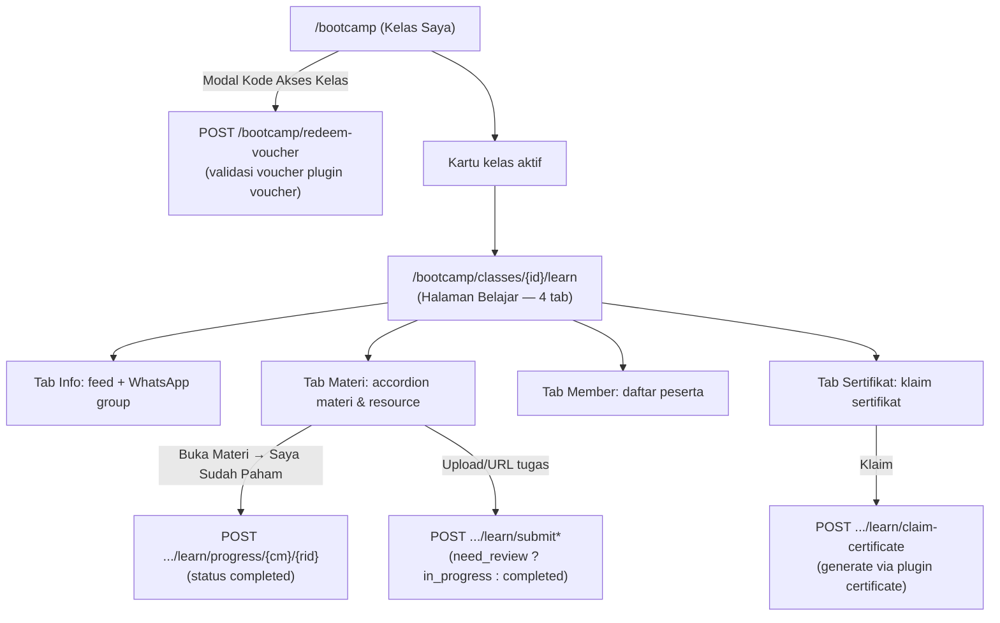

# Spesifikasi Fitur Bootcamp — Halaman Member (WebmanCP)

> Dokumen spesifikasi fitur **Bootcamp (sisi Member)** berdasarkan observasi kode:
> - **Halaman member:** `app/Pages/bootcamp/`
> - **Halaman admin (manage silabus & kelas):** `modules/Classroom/` — lihat **SPEC-BOOTCAMP.md**
>
> Status: **Analisis dari kode sumber** (bukan dokumen desain resmi). Semua detail di bawah diambil dari implementasi aktual.

---

## 1. Ringkasan Eksekutif

Fitur Bootcamp terdiri dari **dua lapisan**. Dokumen ini fokus pada lapisan **Member**:

1. **Halaman Member** (`app/Pages/bootcamp/`) — halaman member yang menampilkan kelas ("Kelas Saya"), halaman belajar, karya, dan sertifikat. Dirender server (SSR) dan data dinamisnya dijalankan via **Alpine.js**; data diambil dari **database** (tabel `cls_*`).
2. **Halaman Admin** (`modules/Classroom/`) — dijelaskan di **SPEC-BOOTCAMP.md**.

**Kesimpulan utama:** Halaman member (`app/Pages/bootcamp`) dan halaman admin (`modules/Classroom`) adalah dua sisi dari fitur Bootcamp yang membaca/menulis tabel `cls_*` yang sama — admin mengelola silabus & kelas, member mengonsumsinya untuk belajar, mengerjakan tugas, memberi feedback, mengklaim sertifikat, dan mengirim karya.

---

## 2. Arsitektur & Lokasi Kode

### 2.1 Halaman Member — `app/Pages/bootcamp/`

| File | Fungsi |
|------|--------|
| `PageController.php` | Controller halaman member. Extends `App\Pages\BaseController` (turunan `Yllumi\Heroic\Controllers\HeroicController` dari package `yllumi/heroic`). |
| `index.php` / `template.php` | View halaman member (Kelas Saya, Belajar, Karya, Sertifikat) — HTML + Tailwind CSS + Alpine.js. |

Routing: page-based routing via `Yllumi\Ci4Pages\PageRouter` (package `yllumi/ci4-pages`); route dideklarasikan di `app/Pages/Router.php` → `GET /bootcamp` dan sub-rute member.

### 2.2 Sisi Admin (referensi)

Halaman admin (`modules/Classroom/` — silabus, materi, resource belajar, kelas, peserta, jadwal, review submission, moderasi karya) dijelaskan penuh di **SPEC-BOOTCAMP.md**.

---

## 3. Data Model (Tabel `cls_*` yang Dipakai Member)

> Skema lengkap semua tabel `cls_*` ada di **SPEC-BOOTCAMP.md §3** (migrasi `modules/Classroom/Database/Migrations/`). Bagian ini hanya tabel yang relevan dengan fitur member.

### 3.1 Kelas & Keanggotaan

**`cls_classes`** — kelas (instance dari silabus)
- Kolom relevan: `id`, `syllabus_id` (RESTRICT), `name`, `thumbnail`, `description`, `status` (`draft/active/archived`), `start_date`, `whatsapp_group_url`, `certificate_requirement` (CSV ID `cls_learning_resources` submission yang wajib selesai), `required_feedback_before_claim_certificate`, `certificate_claimable`.

**`cls_class_materials`** — jadwal materi dalam kelas (pivot materi ↔ kelas)
- Kolom relevan: `id`, `class_id`, `material_id` (unique), `instructor_id`, `scheduled_at`, `is_open`, `opened_at`, `notes`, `meeting_info` (JSON).

**`cls_class_members`** — peserta kelas
- Kolom: `id`, `class_id`, `user_id` (unique), `role` (`member/instructor`), `enrolled_at`, `status` (`active/dropped`), `final_score`.

### 3.2 Konten yang Dikonsumsi

**`cls_learning_resources`** — resource belajar dalam materi (10 tipe)
- Kolom relevan: `id`, `material_id`, `type` (`text, video, pdf, slide, audio, url, book_ref, quiz, submission, meeting`), `title`, `content` (**JSON**), `order_seq`, `completion_criteria` (`view/submit/score_pass`), `is_required`, `need_review`.

**Struktur JSON `content` per tipe resource:**

| Tipe | Key konten |
|------|------------|
| `text` | `html`, `instructions` |
| `video` | `url`, `platform` (default `youtube`), `duration`, `instructions` |
| `pdf` | `file_path`, `instructions` |
| `slide` | `embed_url`, `provider`, `instructions` |
| `audio` | `file_path`, `duration`, `instructions` |
| `url` | `url`, `open_in` (default `tab`), `instructions` |
| `book_ref` | `book_title`, `author`, `chapter`, `page_start`, `page_end`, `isbn`, `instructions` |
| `quiz` | `pass_score` (default 70), `time_limit_minutes` (0 = tanpa batas), `max_attempts` (default 1), `instructions` |
| `submission` | `submission_type` (`upload/url`), `instructions`, `deadline_offset_days`, khusus upload: `allowed_types`, `max_size_mb` (default 10) |
| `meeting` | `description`, `duration`, `mode` (`offline/offline_online`), `instructions` |

### 3.3 Progres, Kuis, Submission

**`cls_learning_progress`** — progres member per resource
- Kolom: `id`, `class_material_id`, `resource_id`, `user_id` (unique), `status` (`not_started/in_progress/completed`), `completed_at`, `meta` (JSON), `created_at`, `updated_at`, `deleted_at`.

**`cls_quiz_questions`** — soal kuis (per resource)
- Kolom: `id`, `resource_id`, `question`, `type` (`multiple_choice/short_answer`), `options` (JSON `[{label,value}]`), `correct_answer`, `score`, `order_seq`.

**`cls_quiz_results`** — hasil kuis
- Kolom: `id`, `progress_id`, `answers` (JSON `{question_id: answer}`), `score`, `max_score`, `passed` (bool), `attempt_number`, `submitted_at`.

**`cls_submissions`** — tugas peserta
- Kolom: `id`, `progress_id`, `type` (`file/url`), `file_path`, `file_name`, `file_size`, `url`, `submitted_at`, `reviewed_by`, `reviewed_at`, `review_score` (0–100), `review_note`, `status` (`submitted/accepted/revision_needed`).

### 3.4 Feed, Feedback, Notifikasi, Karya

**`cls_class_feeds`** — pengumuman kelas
- Kolom: `id`, `class_id`, `title` (opsional), `body` (wajib), `pinned` (bool), `created_by`, `created_at`, `updated_at`.

**`cls_feedbacks`** — feedback peserta (untuk syarat sertifikat & testimoni)
- Kolom: `id`, `class_id`, `user_id` (unique), `profession`, `city`, `condition_before` (enum a–f), `condition_before_other`, `reason_choice`, `favorite_moment`, `rating` (1–5), `concrete_skill`, `message_to_friend`, `allow_testimonial` (bool), timestamps, soft delete.

**`cls_notifications`** — notifikasi
- Kolom: `id`, `user_id`, `type`, `title`, `body`, `read_at`, `meta` (JSON), `created_at`. **Tidak ada halaman/endpoint yang membacanya saat ini** (gap).

**`cls_member_works`** — karya member (showcase)
- Kolom: `id`, `user_id`, `title`, `thumbnail`, `photos` (JSON array), `description`, `short_description`, `status` (`pending/published/rejected`), `url_project`, timestamps, soft delete.

---

## 4. Fitur Halaman Member (`/bootcamp` — `app/Pages/bootcamp/`)

Halaman member dirender server (SSR) di `app/Pages/bootcamp/` (controller extends `App\Pages\BaseController`); data dinamis dijalankan di browser via **Alpine.js**. Autentikasi member via session login web / token (`getUserFromToken()`).

### 4.1 Alur Utama Member

### 4.2 Halaman "Kelas Saya" (`/bootcamp` & `/bootcamp/classes`)

- Header "Bootcamp" + tombol **"Kode Akses Kelas"**.
- Grid kartu kelas aktif (thumbnail, nama, silabus, tanggal mulai) → masuk ke `/learn`.
- State: skeleton loading, empty state, token invalid.

### 4.3 Redeem Voucher (Kode Akses Kelas)

- `POST /bootcamp/redeem-voucher` dengan `voucher_code`.
- Validasi: voucher ada, `product_type='classroom'`, `status='publish'`, belum dipakai, belum expired, `owner_email` cocok.
- Enroll ke kelas (buat `ClassMember` `member/active` atau reaktifasi `dropped`) + catat log `payment_voucher_log`.

### 4.4 Halaman Belajar (`/bootcamp/classes/{id}/learn`) — 4 tab

| Tab | Konten |
|-----|--------|
| **Info** | Daftar feed (pinned dulu), kartu "Selamat datang", sidebar **Grup WhatsApp** |
| **Materi** | Accordion per `class_materials`; materi `is_open=false` di-overlay **lock** ("Menunggu pembukaan dari instruktur"); accordion per resource |
| **Member** | Daftar peserta (badge Instruktur hijau / Peserta abu, avatar inisial) |
| **Sertifikat** | Daftar sertifikat yang diklaim / blok status klaim |

**Render Resource per Tipe** (`detail.php` — render inline via Alpine):

| Tipe | Render |
|------|--------|
| `text` | HTML rich text |
| `video` | Embed YouTube/Vimeo 16:9 atau `<video>` |
| `pdf` | Tombol "Buka PDF Baru" + iframe 520px |
| `slide` | iframe 16:9 dari `embed_url` |
| `audio` | `<audio controls>` |
| `url` | Tombol "Buka Tautan" (tab) atau iframe (frame) |
| `book_ref` | Kartu buku (judul, penulis, badge Bab/Hal./ISBN) |
| `quiz` | Info kuis + tombol **"Kerjakan Kuis — Segera Hadir" (disabled)** — **belum diimplementasikan** |
| `submission` | Widget upload file **atau** URL |
| `meeting` | Detail meeting (instructor, waktu, mode, zoom/venue, rekaman) |

Resource `text/video/pdf/slide/audio/url/book_ref` dibuka di **modal** → tombol "Saya Sudah Paham" (mark progress).

**Meeting** — tombol "Gabung Meeting" & password disembunyikan jika meeting **lewat >3 jam**; rekaman YouTube embed / Bunny modal iframe; absensi di-set admin.

**Submission**:
- Upload file: validasi `max_size_mb` (default 10), blacklist ekstensi berbahaya (`php, phar, sh, exe...`), `allowed_types`, simpan ke `public/uploads/submissions/{class_id}/{cm_id}_{userId}.{ext}`.
- URL: hanya `http/https`.
- `need_review=true` → progress `in_progress` + status `submitted` (menunggu review); `false` → langsung `completed` + `accepted`.
- **Blok re-upload** jika sudah `accepted`.

**Feedback** — modal 9 pertanyaan (profesi, kota, kondisi sebelum bootcamp, alasan, momen berkesan, rating bintang 1–5, skill konkret, pesan ke teman, izin testimoni). `POST /bootcamp/classes/{id}/learn/feedback` (unique class+user).

**Klaim Sertifikat** — urutan pengecekan:
1. Sudah punya sertifikat aktif untuk kelas → tolak.
2. `certificate_claimable=false` → tolak.
3. `certificate_requirement` (CSV resource id) → semua harus `completed`.
4. `required_feedback_before_claim_certificate=true` → wajib sudah isi feedback.
5. Lolos → `Certificate::generateCertificate(...)`: `entity_type='bootcamp'`, `template_name='bootcamp'` (template `BootcampVibeCodingCertificateTemplate`), URL `https://codepolitan.com/p/certificate/{code}`.

### 4.5 Karya Member (Showcase)

| Halaman / API | Fungsi |
|---------------|--------|
| `/bootcamp/works` | "Karya Saya" — grid karya sendiri, filter status, pagination 12, detail modal, edit/hapus |
| `/bootcamp/works/create` | Form karya (judul*, deskripsi singkat ≤500, deskripsi, thumbnail URL, galeri multi-URL, URL project) |
| `/bootcamp/works/{id}/edit` | Edit (hanya jika status `pending`) |
| `GET/POST /api/member/works*` | API member (token Bearer/cookie) — CRUD karya sendiri |
| `GET /api/works` | **Public list API tanpa token** — hanya `published`, join nama user, search |
| Admin `/{urlScope}/classroom/memberworks` | Moderasi (publish/reject), email notifikasi saat approved — lihat **SPEC-BOOTCAMP.md** |

---

## 5. Integrasi Plugin Lain (sisi Member)

| Plugin | Titik Integrasi |
|--------|-----------------|
| **`yllumi/ci4-pages`** | Page-based routing `Yllumi\Ci4Pages\PageRouter` + helper `pageview` untuk halaman member di `app/Pages/` |
| **`voucher`** | Redeem kode akses kelas (`product_type='classroom'`, cek `payment_voucher_log`) |
| **`certificate`** | `Certificate::generateCertificate()` entity `bootcamp` (prefix `BC`), template `bootcamp` (`BootcampVibeCodingCertificateTemplate`) |
| **`emailsender`** | Email notifikasi karya disetujui (slug `member-work-approved`) — dikirim saat admin memoderasi |

> Integrasi sisi admin (`yllumi/heroic` + `Heroicadmin`, konfigurasi klaim `certificate`) dijelaskan di **SPEC-BOOTCAMP.md §5**.

---

## 6. Status Enum yang Dipakai (sisi Member)

| Entitas | Nilai |
|---------|-------|
| Kelas | `draft` → `active` → `archived` |
| ClassMember role | `member` / `instructor` |
| ClassMember status | `active` / `dropped` |
| LearningProgress | `not_started` / `in_progress` / `completed` |
| Submission | `submitted` / `accepted` / `revision_needed` |
| MemberWork | `pending` / `published` / `rejected` |
| Resource completion_criteria | `view` / `submit` / `score_pass` |
| Resource type | `text, video, pdf, slide, audio, url, book_ref, quiz, submission, meeting` |

> Daftar enum lengkap (termasuk sisi admin) ada di **SPEC-BOOTCAMP.md §6**.

---

## 7. Celah / Keterbatasan (Gaps) — Hasil Observasi (Member)

Berikut ketidaksesuaian antara kode yang ada dengan fungsionalitas yang tampaknya diinginkan. **Ini bukan bug yang diminta diperbaiki, hanya catatan analisis:**

1. **Landing page (marketing) terpisah dari halaman member** — landing page promosi tidak lagi berada di `app/Pages/bootcamp` (kini halaman member); data programnya tidak sinkron dengan `cls_syllabuses`/`cls_materials`.
2. **Galeri karya memakai Cockpit CMS eksternal** — landing page memakai Cockpit CMS (bukan tabel `cls_member_works` milik kelas).
3. **Kuis belum bisa dikerjakan member** — schema `cls_quiz_questions`/`cls_quiz_results` lengkap dan admin bisa lihat hasil, tetapi tombol "Kerjakan Kuis — Segera Hadir" disabled; tidak ada endpoint attempt.
4. **`_resource_renderer.php` dan `intro.php` adalah dead code** — halaman intro langsung redirect; render resource dilakukan inline di `detail.php`.
5. **`cls_notifications` belum dikonsumsi** — tabel dibuat namun belum ada halaman/endpoint pembacanya.
6. **Role `instructor` belum punya hak khusus di sisi member** — hanya label di tab Member.

> Gap sisi admin (scoring engine, `instructor_id` tidak bisa diisi, dead code `LearningResourceController`, dll.) dijelaskan di **SPEC-BOOTCAMP.md §7**.

---

## 8. Teknologi & Konvensi (sisi Member)

| Aspek | Detail |
|-------|--------|
| Framework | CodeIgniter 4 (PHP 8) |
| Backend | PHP 8; halaman member extends `App\Pages\BaseController` (→ `Yllumi\Heroic\Controllers\HeroicController`) |
| ORM / DB | CodeIgniter Model (`CodeIgniter\Model`) — tabel `cls_*` |
| Migration | CodeIgniter Migration (`spark migrate`, file di `modules/Classroom/Database/Migrations/`) |
| Frontend | Raw PHP view + Tailwind CSS (CDN) + Alpine.js 3 (CDN) |
| Auth Member | Session login web / token (`getUserFromToken()`) |
| Routing | `Yllumi\Ci4Pages\PageRouter` (`yllumi/ci4-pages`) — route di `app/Pages/Router.php` |
| UI Language | Bahasa Indonesia (pesan, label, validasi) |
| Naming | Controller suffix `Controller`, method verb-prefix (`getIndex`, `postStore`), tabel `cls_*` plural snake_case, FK `{table}_id` |

---

## 9. Ringkasan Alur Kritis (Member)

**Alur Member:** Redeem voucher → lihat kelas di "Kelas Saya" → belajar per materi (progres, submission, meeting) → isi feedback → klaim sertifikat (jika memenuhi syarat) → submit karya ke showcase.

**Alur Sertifikat (Member):** Admin atur `certificate_claimable`, `certificate_requirement` (CSV resource submission), dan opsi wajib feedback (lihat **SPEC-BOOTCAMP.md**) → member selesaikan tugas wajib & feedback → `claim-certificate` → `Certificate::generateCertificate` (template bootcamp) → tampil di tab Sertifikat.

**Alur Aktivasi Kelas (Admin)** dijelaskan penuh di **SPEC-BOOTCAMP.md**.
