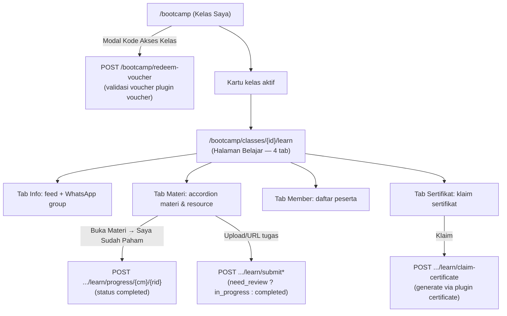

# Spesifikasi Fitur Bootcamp — WebmanCP

> Dokumen spesifikasi fitur **Bootcamp** berdasarkan observasi kode:
> - **Halaman member:** `app/Pages/bootcamp/`
> - **Halaman admin (manage silabus & kelas):** `modules/Classroom/`
>
> Status: **Analisis dari kode sumber** (bukan dokumen desain resmi). Semua detail di bawah diambil dari implementasi aktual.

---

## 1. Ringkasan Eksekutif

Fitur Bootcamp terdiri dari **dua lapisan**:

1. **Halaman Member** (`app/Pages/bootcamp/`) — halaman member yang menampilkan kelas ("Kelas Saya"), halaman belajar, karya, dan sertifikat. Dirender server (SSR) dan data dinamisnya dijalankan via **Alpine.js**; data diambil dari **database** (tabel `cls_*`).
2. **Halaman Admin** (`modules/Classroom/`) — halaman admin untuk **manage silabus dan kelas**: silabus, materi, resource belajar, kelas, peserta, jadwal, review submission, feedback, sertifikat, dan moderasi karya member. **Data dikelola di database** (tabel `cls_*`).

**Kesimpulan utama:** Halaman member (`app/Pages/bootcamp`) dan halaman admin (`modules/Classroom`) adalah dua sisi dari fitur Bootcamp yang membaca/menulis tabel `cls_*` yang sama — admin mengelola silabus & kelas, member mengonsumsinya untuk belajar, mengerjakan tugas, memberi feedback, mengklaim sertifikat, dan mengirim karya.

---

## 2. Arsitektur & Lokasi Kode

```mermaid
flowchart LR
    subgraph Member[Member /bootcamp — app/Pages/bootcamp]
        A["PageController<br/>(extends App\\Pages\\BaseController)"] --> B["index.php / template.php<br/>(Kelas Saya · Belajar · Karya · Sertifikat)"]
        B --> L["redeem voucher"]
        B --> M["klaim sertifikat"]
        B --> K["submit karya"]
    end

    subgraph Admin[Admin /{urlScope}/classroom — modules/Classroom]
        D["SyllabusController"] --> E["MaterialController<br/>(+ Resource CRUD)"]
        F["ClassRoomController"] --> G["ScheduleController"]
        H["MemberController"] --> I["FeedController"]
        J["FeedbackController"] --> Q["MemberWorkController (moderasi)"]
    end

    subgraph Integrasi[Integrasi Plugin Lain]
        N["plugin/voucher — redeem kode akses"]
        O["plugin/certificate — generate sertifikat bootcamp"]
        P["plugin/emailsender — email notifikasi karya disetujui"]
    end

    L -.-> N
    M -.-> O
    K -.-> P
```

### 2.1 Halaman Member — `app/Pages/bootcamp/`

| File | Fungsi |
|------|--------|
| `PageController.php` | Controller halaman member. Extends `App\Pages\BaseController` (turunan `Yllumi\Heroic\Controllers\HeroicController` dari package `yllumi/heroic`). |
| `index.php` / `template.php` | View halaman member (Kelas Saya, Belajar, Karya, Sertifikat) — HTML + Tailwind CSS + Alpine.js. |

Routing: page-based routing via `Yllumi\Ci4Pages\PageRouter` (package `yllumi/ci4-pages`); route dideklarasikan di `app/Pages/Router.php` → `GET /bootcamp` dan sub-rute member.

### 2.2 Halaman Admin — `modules/Classroom/` (manage silabus & kelas)

```
modules/Classroom/
├── Config/
│   └── Routes.php        # Definisi route admin (grup `{urlScope}/classroom`)
├── Controllers/          # Controller admin (extends Heroicadmin\Controllers\AdminController)
│   ├── Syllabus.php      # Manage silabus
│   ├── Material.php      # Manage materi & resource
│   ├── ClassRoom.php     # Manage kelas
│   ├── Schedule.php      # Jadwal & detail materi
│   ├── Member.php        # Manage peserta
│   ├── Feed.php          # Pengumuman kelas
│   ├── Feedback.php      # Review feedback peserta
│   └── MemberWork.php    # Moderasi karya member
├── Models/               # Model tabel cls_*
├── Views/                # UI admin (extends Heroicadmin\Views\_layouts\admin)
└── Database/Migrations/  # Migrasi CodeIgniter (tabel cls_*)
```

---

## 3. Data Model (Tabel `cls_*`)

Berikut skema hasil observasi migrasi `modules/Classroom/Database/Migrations/`.

### 3.1 Master Konten (Silabus & Materi)

**`cls_syllabuses`** — silabus / kurikulum program
| Kolom | Tipe | Keterangan |
|-------|------|------------|
| `id` | bigint PK | |
| `name` | string(255) | Nama silabus |
| `subtitle` | string(255) | Subjudul (migration 0705) |
| `description` | text | Deskripsi |
| `status` | enum `draft/published` | Hanya `published` yang bisa dipakai kelas |
| `created_by` | bigint | Admin pembuat (dari session) |
| `created_at`, `updated_at` | timestamp | |
| `deleted_at` | timestamp | Soft delete |

**`cls_materials`** — materi (sesi/pertemuan) dalam silabus
| Kolom | Tipe | Keterangan |
|-------|------|------------|
| `id` | bigint PK | |
| `syllabus_id` | bigint FK | CASCADE |
| `title` | string(255) | |
| `subtitle` | string(255) | |
| `description` | text | |
| `order_seq` | smallint | Urutan materi |
| `weight` | smallint | Bobot nilai (belum dipakai logika) |
| `scoring_type` | enum `auto/manual` | Tipe penilaian (belum dipakai logika) |
| `deleted_at` | timestamp | Soft delete |

**`cls_learning_resources`** — resource belajar dalam materi (10 tipe)
| Kolom | Tipe | Keterangan |
|-------|------|------------|
| `id` | bigint PK | |
| `material_id` | bigint FK | CASCADE |
| `type` | string(50) | `text, video, pdf, slide, audio, url, book_ref, quiz, submission, meeting` (legacy `zoom`/`location` dinormalisasi jadi `meeting`) |
| `title` | string(255) | |
| `content` | text | **JSON** — struktur konten berbeda per tipe |
| `order_seq` | smallint | Urutan |
| `completion_criteria` | enum `view/submit/score_pass` | Kriteria selesai |
| `is_required` | boolean | Wajib / tidak |
| `need_review` | boolean | Jika `false`, submission langsung auto-accepted (migration 0722) |
| `deleted_at` | timestamp | Soft delete |

**Struktur JSON `content` per tipe resource:**

| Tipe | Key konten |
|------|------------|
| `text` | `html`, `instructions` |
| `video` | `url`, `platform` (default `youtube`), `duration`, `instructions` |
| `pdf` | `file_path`, `instructions` |
| `slide` | `embed_url`, `provider`, `instructions` |
| `audio` | `file_path`, `duration`, `instructions` |
| `url` | `url`, `open_in` (default `tab`), `instructions` |
| `book_ref` | `book_title`, `author`, `chapter`, `page_start`, `page_end`, `isbn`, `instructions` |
| `quiz` | `pass_score` (default 70), `time_limit_minutes` (0 = tanpa batas), `max_attempts` (default 1), `instructions` |
| `submission` | `submission_type` (`upload/url`), `instructions`, `deadline_offset_days`, khusus upload: `allowed_types`, `max_size_mb` (default 10) |
| `meeting` | `description`, `duration`, `mode` (`offline/offline_online`), `instructions` |

### 3.2 Kelas & Keanggotaan

**`cls_classes`** — kelas (instance dari silabus)
| Kolom | Tipe | Keterangan |
|-------|------|------------|
| `id` | bigint PK | |
| `syllabus_id` | bigint FK | RESTRICT |
| `name` | string(255) | Nama kelas |
| `thumbnail` | string(500) | Gambar kelas |
| `description` | text | |
| `status` | enum `draft/active/archived` | |
| `start_date` | date | Tanggal mulai |
| `whatsapp_group_url` | string(500) | Link grup WhatsApp |
| `certificate_requirement` | text | **CSV ID `cls_learning_resources`** (resource submission) yang wajib selesai untuk klaim sertifikat |
| `required_feedback_before_claim_certificate` | boolean | Wajib isi feedback sebelum klaim |
| `certificate_claimable` | boolean | Master gate — sertifikat siap diklaim |
| `created_by` | bigint | |

**`cls_class_materials`** — jadwal materi dalam kelas (pivot materi ↔ kelas)
| Kolom | Tipe | Keterangan |
|-------|------|------------|
| `id` | bigint PK | |
| `class_id`, `material_id` | bigint FK (unique) | |
| `instructor_id` | bigint | **Tidak ada route untuk mengisinya** (gap) |
| `scheduled_at` | datetime | Jadwal |
| `is_open` | boolean | Materi dibuka/tutup oleh instruktur |
| `opened_at` | datetime | Waktu dibuka |
| `notes` | text | Catatan |
| `meeting_info` | text | **JSON** override info meeting per resource (`resource_{id}` → `url`, `location`, `notes`) |

**`cls_class_material_resources`** — metadata per resource dalam kelas (pivot class+resource)
| Kolom | Tipe | Keterangan |
|-------|------|------------|
| `class_id`, `material_id`, `resource_id` | int | |
| `metadata` | text | JSON detail meeting (instructor_name, zoom_link, venue, dsb.) |

**`cls_class_members`** — peserta kelas
| Kolom | Tipe | Keterangan |
|-------|------|------------|
| `id` | bigint PK | |
| `class_id`, `user_id` | bigint FK (unique) | |
| `role` | enum `member/instructor` | Hanya untuk label di UI |
| `enrolled_at` | timestamp | |
| `status` | enum `active/dropped` | |
| `final_score` | decimal(5,2) | **Belum diisi logika apa pun** (gap) |

### 3.3 Progres, Kuis, Submission, Penilaian

**`cls_learning_progress`** — progres member per resource
- Kolom: `id`, `class_material_id`, `resource_id`, `user_id` (unique), `status` enum `not_started/in_progress/completed`, `completed_at`, `meta` (JSON), `created_at`, `updated_at`, `deleted_at`.

**`cls_quiz_questions`** — soal kuis (per resource)
- Kolom: `id`, `resource_id`, `question`, `type` enum `multiple_choice/short_answer`, `options` (JSON `[{label,value}]`), `correct_answer`, `score`, `order_seq`.

**`cls_quiz_results`** — hasil kuis
- Kolom: `id`, `progress_id`, `answers` (JSON `{question_id: answer}`), `score`, `max_score`, `passed` (bool), `attempt_number`, `submitted_at`.

**`cls_submissions`** — tugas peserta
- Kolom: `id`, `progress_id`, `type` enum `file/url`, `file_path`, `file_name`, `file_size`, `url`, `submitted_at`, `reviewed_by`, `reviewed_at`, `review_score` (0–100), `review_note`, `status` enum `submitted/accepted/revision_needed`.

**`cls_member_scores`** — skor member per materi
- Kolom: `id`, `class_material_id`, `user_id` (unique), `raw_score`, `final_score`, `scoring_type` enum `auto/manual`, `scored_by`, `scored_at`, `notes`, `status` enum `pending/scored/reviewed`. **Tabel ada tetapi belum ada logika yang menulisnya** (gap).

### 3.4 Feed, Feedback, Notifikasi, Karya

**`cls_class_feeds`** — pengumuman kelas
- Kolom: `id`, `class_id`, `title` (opsional), `body` (wajib), `pinned` (bool), `created_by`, `created_at`, `updated_at`.

**`cls_feedbacks`** — feedback peserta (untuk syarat sertifikat & testimoni)
- Kolom: `id`, `class_id`, `user_id` (unique), `profession`, `city`, `condition_before` (enum a–f), `condition_before_other`, `reason_choice`, `favorite_moment`, `rating` (1–5), `concrete_skill`, `message_to_friend`, `allow_testimonial` (bool), timestamps, soft delete.

**`cls_notifications`** — notifikasi
- Kolom: `id`, `user_id`, `type`, `title`, `body`, `read_at`, `meta` (JSON), `created_at`. **Tidak ada halaman/endpoint yang membacanya saat ini** (gap).

**`cls_member_works`** — karya member (showcase)
- Kolom: `id`, `user_id`, `title`, `thumbnail`, `photos` (JSON array), `description`, `short_description`, `status` enum `pending/published/rejected`, `url_project`, timestamps, soft delete.

---

## 4. Fitur Halaman Member (`/bootcamp` — `app/Pages/bootcamp/`)

Halaman member dirender server (SSR) di `app/Pages/bootcamp/` (controller extends `App\Pages\BaseController`); data dinamis dijalankan di browser via **Alpine.js**. Autentikasi member via session login web / token (`getUserFromToken()`).

### 4.1 Alur Utama Member



### 4.2 Halaman "Kelas Saya" (`/bootcamp` & `/bootcamp/classes`)

- Header "Bootcamp" + tombol **"Kode Akses Kelas"**.
- Grid kartu kelas aktif (thumbnail, nama, silabus, tanggal mulai) → masuk ke `/learn`.
- State: skeleton loading, empty state, token invalid.

### 4.3 Redeem Voucher (Kode Akses Kelas)

- `POST /bootcamp/redeem-voucher` dengan `voucher_code`.
- Validasi: voucher ada, `product_type='classroom'`, `status='publish'`, belum dipakai, belum expired, `owner_email` cocok.
- Enroll ke kelas (buat `ClassMember` `member/active` atau reaktifasi `dropped`) + catat log `payment_voucher_log`.

### 4.4 Halaman Belajar (`/bootcamp/classes/{id}/learn`) — 4 tab

| Tab | Konten |
|-----|--------|
| **Info** | Daftar feed (pinned dulu), kartu "Selamat datang", sidebar **Grup WhatsApp** |
| **Materi** | Accordion per `class_materials`; materi `is_open=false` di-overlay **lock** ("Menunggu pembukaan dari instruktur"); accordion per resource |
| **Member** | Daftar peserta (badge Instruktur hijau / Peserta abu, avatar inisial) |
| **Sertifikat** | Daftar sertifikat yang diklaim / blok status klaim |

**Render Resource per Tipe** (`detail.php` — render inline via Alpine):

| Tipe | Render |
|------|--------|
| `text` | HTML rich text |
| `video` | Embed YouTube/Vimeo 16:9 atau `<video>` |
| `pdf` | Tombol "Buka PDF Baru" + iframe 520px |
| `slide` | iframe 16:9 dari `embed_url` |
| `audio` | `<audio controls>` |
| `url` | Tombol "Buka Tautan" (tab) atau iframe (frame) |
| `book_ref` | Kartu buku (judul, penulis, badge Bab/Hal./ISBN) |
| `quiz` | Info kuis + tombol **"Kerjakan Kuis — Segera Hadir" (disabled)** — **belum diimplementasikan** |
| `submission` | Widget upload file **atau** URL |
| `meeting` | Detail meeting (instructor, waktu, mode, zoom/venue, rekaman) |

Resource `text/video/pdf/slide/audio/url/book_ref` dibuka di **modal** → tombol "Saya Sudah Paham" (mark progress).

**Meeting** — tombol "Gabung Meeting" & password disembunyikan jika meeting **lewat >3 jam**; rekaman YouTube embed / Bunny modal iframe; absensi di-set admin.

**Submission**:
- Upload file: validasi `max_size_mb` (default 10), blacklist ekstensi berbahaya (`php, phar, sh, exe...`), `allowed_types`, simpan ke `public/uploads/submissions/{class_id}/{cm_id}_{userId}.{ext}`.
- URL: hanya `http/https`.
- `need_review=true` → progress `in_progress` + status `submitted` (menunggu review); `false` → langsung `completed` + `accepted`.
- **Blok re-upload** jika sudah `accepted`.

**Feedback** — modal 9 pertanyaan (profesi, kota, kondisi sebelum bootcamp, alasan, momen berkesan, rating bintang 1–5, skill konkret, pesan ke teman, izin testimoni). `POST /bootcamp/classes/{id}/learn/feedback` (unique class+user).

**Klaim Sertifikat** — urutan pengecekan:
1. Sudah punya sertifikat aktif untuk kelas → tolak.
2. `certificate_claimable=false` → tolak.
3. `certificate_requirement` (CSV resource id) → semua harus `completed`.
4. `required_feedback_before_claim_certificate=true` → wajib sudah isi feedback.
5. Lolos → `Certificate::generateCertificate(...)`: `entity_type='bootcamp'`, `template_name='bootcamp'` (template `BootcampVibeCodingCertificateTemplate`), URL `https://codepolitan.com/p/certificate/{code}`.

### 4.5 Karya Member (Showcase)

| Halaman / API | Fungsi |
|---------------|--------|
| `/bootcamp/works` | "Karya Saya" — grid karya sendiri, filter status, pagination 12, detail modal, edit/hapus |
| `/bootcamp/works/create` | Form karya (judul*, deskripsi singkat ≤500, deskripsi, thumbnail URL, galeri multi-URL, URL project) |
| `/bootcamp/works/{id}/edit` | Edit (hanya jika status `pending`) |
| `GET/POST /api/member/works*` | API member (token Bearer/cookie) — CRUD karya sendiri |
| `GET /api/works` | **Public list API tanpa token** — hanya `published`, join nama user, search |
| Admin `/{urlScope}/classroom/memberworks` | Moderasi (publish/reject), email notifikasi saat approved |

---

## 5. Fitur Admin (Panel `/{urlScope}/classroom` — `modules/Classroom/`)

Semua route admin di grup `{urlScope}/classroom` (default `/ruangpanel/classroom`, didefinisikan di `modules/Classroom/Config/Routes.php`), controller extends `Heroicadmin\Controllers\AdminController` (auth via session `user_id()` + cek role).

### 5.1 Manajemen Silabus — `SyllabusController`

| Endpoint | Fungsi |
|----------|--------|
| `GET /syllabuses` | Halaman "Manajemen Silabus" |
| `GET /syllabuses/data` | Datatable (search, filter status, pagination, count materi) |
| `POST /syllabuses/store` | Buat silabus (status default `draft`) |
| `POST /syllabuses/{id}/update` | Update; **hanya bisa `published` jika minimal punya 1 materi** |
| `POST /syllabuses/{id}/duplicate` | **Duplikasi** (deep copy materi + resource, status baru selalu `draft`) |
| `POST /syllabuses/{id}/delete` | **Diblok** jika silabus dipakai kelas `active` |

### 5.2 Manajemen Materi & Resource — `MaterialController`

| Endpoint | Fungsi |
|----------|--------|
| `GET /syllabuses/{sid}/materials` | Halaman materi (layout 2 panel) |
| `GET .../materials/data` | List materi + resource (tanpa pagination) |
| `POST .../materials/store` · `/{id}/update` · `/{id}/delete` | CRUD materi (`weight`, `scoring_type`) |
| `POST .../materials/reorder` | **Reorder** materi (JSON body atau form `orders[]`) |
| `POST .../materials/{mid}/resources/store` | Tambah resource |
| `POST .../materials/{mid}/resources/reorder` | Reorder resource |
| `POST .../materials/{mid}/resources/{id}/update` · `/{id}/delete` | Update/hapus resource |

Detail resource:
- Validasi `title` wajib, `type` ∈ 10 tipe, `completion_criteria` ∈ `view/submit/score_pass`, `is_required` & `need_review` default `true`.
- Form konten dinamis per tipe (sesuai JSON `content` di §3.1).

### 5.3 Manajemen Kelas — `ClassRoomController`

| Endpoint | Fungsi |
|----------|--------|
| `GET /classes` · `/classes/data` | Halaman & datatable kelas |
| `GET /classes/syllabuses` | Dropdown silabus `published` |
| `GET /classes/resources?syllabus_id=` | Checklist **resource `submission`** untuk pengaturan sertifikat |
| `POST /classes/store` | Buat kelas — **hanya silabus `published`**; **kelas baru tidak bisa langsung `active`** (harus `draft` dulu); **auto-generate `ClassMaterial`** untuk tiap materi silabus (`is_open=false`) |
| `POST /classes/{id}/update` | Update; **aktivasi** (`draft→active`) diblok jika: (1) ada materi silabus belum di-sync, (2) ada `class_materials` tanpa `scheduled_at` |
| `POST /classes/{id}/delete` | Kelas `active` tidak bisa dihapus (harus `archived` dulu) |

Pengaturan sertifikat (di form kelas):
- `certificate_claimable` — gate utama klaim.
- `certificate_requirement` — CSV ID resource submission wajib selesai.
- `required_feedback_before_claim_certificate` — wajib isi feedback.

### 5.4 Jadwal & Detail Materi — `ScheduleController` (terbesar)

| Endpoint | Fungsi |
|----------|--------|
| `GET /classes/{id}/schedule` · `/data` | Halaman jadwal; list materi dengan flag `is_unsynced` (LEFT JOIN) |
| `POST .../schedule/sync` | **Sinkronkan** materi silabus → `class_materials` |
| `POST .../schedule/{cm_id}/update` | Set `scheduled_at` + `notes` |
| `POST .../schedule/{cm_id}/toggle-open` | **Buka/tutup materi** (`is_open`, set `opened_at`) |
| `GET .../schedule/{cm_id}` · `/data` | Detail materi |
| `GET .../schedule/{cm_id}/progress` | **Progres peserta** (% = completed resource wajib / total wajib) |
| `GET .../schedule/{cm_id}/quiz-results` | Hasil kuis (per attempt, urut attempt desc) |
| `GET .../schedule/{cm_id}/submissions` | List submission + review |
| `POST .../schedule/{cm_id}/meeting-info` | Simpan info meeting per resource (JSON di `meeting_info`) |
| `POST .../schedule/{cm_id}/submissions/{sub_id}/review` | **Penilaian submission** (status `submitted/accepted/revision_needed`, score 0–100; `accepted` → progres `completed`) |
| `GET .../submissions/{sub_id}/download` | Download file tugas (dengan **anti path traversal**) |
| `GET .../schedule/{cm_id}/resource/{rid}` | Matriks status per resource (kuis → hasil terakhir, submission → detail review, meeting → detail) |
| `POST .../resource/{rid}/meeting-detail` | Simpan **detail tatap muka** (zoom/venue, mode online/offline) |
| `POST .../resource/{rid}/attendance` | **Set absensi** (upsert progress `completed`/`not_started`) |

### 5.5 Manajemen Peserta — `MemberController`

| Endpoint | Fungsi |
|----------|--------|
| `GET /classes/{id}/members` · `/data` | Halaman & datatable peserta |
| `GET .../members/search?q=` | Cari user `mein_users` (exclude member aktif kelas) |
| `POST .../members/add` | Tambah 1 member (role `member/instructor`); **reaktifasi** jika status `dropped` |
| `POST .../members/bulk` | **Tambah massal via CSV** (validasi email, reaktifasi dropped, laporan `added/skipped/not_found`) |
| `POST .../members/{mid}/drop` · `/restore` | Drop / aktifkan kembali |

### 5.6 Feed, Feedback, Karya Member

**`FeedController`** (`class.read/write/delete`) — CRUD pengumuman kelas (`cls_class_feeds`), dukung pin/unpin.

**`FeedbackController`** (`class.read`) — **read-only**: datatable feedback peserta (profesi, kota, rating, testimoni) untuk verifikasi syarat klaim sertifikat.

**`MemberWorkController`** (`memberwork.read/write/delete`) — moderasi karya member:
- Datatable + detail + admin dapat membuat/mengedit karya (bisa ganti pemilik).
- `moderate()` → set `published`/`rejected`; saat `published` **kirim email** via `EmailSender::sendBySlug('member-work-approved', ...)`.
- Soft delete.

---

## 6. Integrasi Plugin Lain

| Plugin | Titik Integrasi |
|--------|-----------------|
| **`yllumi/heroic`** | Base controller `Yllumi\Heroic\Controllers\HeroicController` + modul admin `Heroicadmin` (`Heroicadmin\Controllers\AdminController`, layout `Heroicadmin\Views\_layouts\admin`) |
| **`yllumi/ci4-pages`** | Page-based routing `Yllumi\Ci4Pages\PageRouter` + helper `pageview` untuk halaman member di `app/Pages/` |
| **`voucher`** | Redeem kode akses kelas (`product_type='classroom'`, cek `payment_voucher_log`) |
| **`certificate`** | `Certificate::generateCertificate()` entity `bootcamp` (prefix `BC`), template `bootcamp` (`BootcampVibeCodingCertificateTemplate`) |
| **`emailsender`** | Email notifikasi karya disetujui (slug `member-work-approved`) |

---

## 7. Status Enum yang Dipakai

| Entitas | Nilai |
|---------|-------|
| Syllabus | `draft` → `published` |
| Kelas | `draft` → `active` → `archived` |
| ClassMember role | `member` / `instructor` |
| ClassMember status | `active` / `dropped` |
| LearningProgress | `not_started` / `in_progress` / `completed` |
| Submission | `submitted` / `accepted` / `revision_needed` |
| MemberWork | `pending` / `published` / `rejected` |
| Resource completion_criteria | `view` / `submit` / `score_pass` |
| Resource type | `text, video, pdf, slide, audio, url, book_ref, quiz, submission, meeting` |

---

## 8. Celah / Keterbatasan (Gaps) — Hasil Observasi

Berikut ketidaksesuaian antara kode yang ada dengan fungsionalitas yang tampaknya diinginkan. **Ini bukan bug yang diminta diperbaiki, hanya catatan analisis:**

1. **Landing page (marketing) terpisah dari halaman member** — landing page promosi tidak lagi berada di `app/Pages/bootcamp` (kini halaman member); data programnya tidak sinkron dengan `cls_syllabuses`/`cls_materials`.
2. **Galeri karya memakai Cockpit CMS eksternal** — landing page memakai Cockpit CMS (bukan tabel `cls_member_works` milik kelas).
3. **Kuis belum bisa dikerjakan member** — schema `cls_quiz_questions`/`cls_quiz_results` lengkap dan admin bisa lihat hasil, tetapi tombol "Kerjakan Kuis — Segera Hadir" disabled; tidak ada endpoint attempt.
4. **Scoring engine belum ada** — `cls_member_scores`, `cls_class_members.final_score`, `material.weight`, `material.scoring_type` ada di schema/admin tapi tidak diisi logika apa pun.
5. **`instructor_id` di `cls_class_materials` tidak bisa diisi** — tidak ada route/form admin; validasi aktivasi kelas hanya cek `scheduled_at`.
6. **`LearningResourceController` (admin) adalah dead code** — tidak terdaftar di `Config/Routes.php`; logika resource hidup di `MaterialController`.
7. **`_resource_renderer.php` dan `intro.php` adalah dead code** — halaman intro langsung redirect; render resource dilakukan inline di `detail.php`.
8. **`cls_notifications` belum dikonsumsi** — tabel dibuat namun belum ada halaman/endpoint pembacanya.
9. **`quizResultsData` menampilkan semua attempt** (tidak dedup), sedangkan matriks `resourceStudents` hanya menampilkan hasil terakhir — inkonsistensi kecil.
10. **Role `instructor` belum punya hak khusus di sisi member** — hanya label di tab Member.

---

## 9. Teknologi & Konvensi

| Aspek | Detail |
|-------|--------|
| Framework | CodeIgniter 4 (PHP 8) |
| Backend | PHP 8; controller admin extends `Heroicadmin\Controllers\AdminController`, halaman member extends `App\Pages\BaseController` (→ `Yllumi\Heroic\Controllers\HeroicController`) |
| ORM / DB | CodeIgniter Model (`CodeIgniter\Model`) — tabel `cls_*` |
| Migration | CodeIgniter Migration (`spark migrate`, file di `modules/Classroom/Database/Migrations/`) |
| Frontend | Raw PHP view + Tailwind CSS (CDN) + Alpine.js 3 (CDN) |
| Auth Admin | `Heroicadmin\Controllers\AdminController` — cek session `user_id()` + role |
| Auth Member | Session login web / token (`getUserFromToken()`) |
| Routing | `Yllumi\Ci4Pages\PageRouter` (`yllumi/ci4-pages`) untuk halaman member di `app/Pages/`; `modules/Classroom/Config/Routes.php` untuk admin |
| UI Language | Bahasa Indonesia (pesan, label, validasi) |
| Naming | Controller suffix `Controller`, method verb-prefix (`getIndex`, `postStore`), tabel `cls_*` plural snake_case, FK `{table}_id` |

---

## 10. Ringkasan Alur Kritis

**Aktivasi Kelas (Admin):** Silabus `published` → buat kelas `draft` → kelola jadwal (sync materi, set `scheduled_at`) → aktivasi `active` (harus semua materi ter-sync & terjadwal) → buka/tutup materi via `toggle-open` → kelola peserta & feed.

**Alur Member:** Redeem voucher → lihat kelas di "Kelas Saya" → belajar per materi (progres, submission, meeting) → isi feedback → klaim sertifikat (jika memenuhi syarat) → submit karya ke showcase.

**Alur Sertifikat:** Admin atur `certificate_claimable`, `certificate_requirement` (CSV resource submission), dan opsi wajib feedback → member selesaikan tugas wajib & feedback → `claim-certificate` → `Certificate::generateCertificate` (template bootcamp) → tampil di tab Sertifikat.
