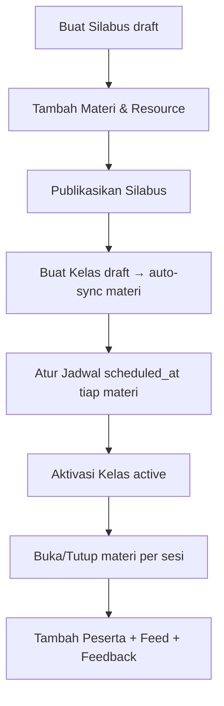
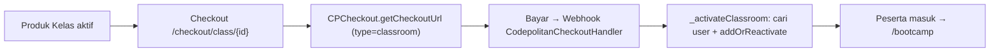

# Modul Classroom (Bootcamp)

Modul admin **Classroom / Bootcamp** untuk CodeIgniter 4 — mengelola silabus, materi, resource belajar, kelas, jadwal, peserta, pengumuman, feedback, moderasi karya member, pengaturan sertifikat, dan **produk kelas** (penjualan bootcamp/checkout).

Dibangun berdasarkan `SPEC-BOOTCAMP.md`. Semua data disimpan di tabel `cls_*` (17 tabel).

> Catatan: README ini mendokumentasikan **halaman admin** (`modules/Classroom/`). Halaman member (`/bootcamp` di `app/Pages/bootcamp/`) sudah aktif dan memakai model modul ini (daftar kelas, intro, materi, progres, karya) — namun dibahas terpisah.

---

## Struktur

```
modules/Classroom/
├── Config/
│   └── Routes.php              # Route grup {urlScope}/classroom
├── Controllers/
│   ├── Syllabus.php            # CRUD silabus + duplikasi (deep copy)
│   ├── Material.php            # CRUD materi + resource (konten JSON per tipe)
│   ├── ClassRoom.php           # CRUD kelas + pengaturan sertifikat
│   ├── Schedule.php            # Jadwal, detail, progres, kuis, submission, meeting, absensi
│   ├── Member.php              # Kelola peserta (tambah, import CSV, drop/restore)
│   ├── Feed.php                # Pengumuman kelas (pin/unpin)
│   ├── Feedback.php            # Review feedback peserta (read-only)
│   ├── MemberWork.php          # Moderasi karya member + email saat approved
│   └── Product.php             # Produk kelas (harga/diskon/status) + generate link checkout
├── Models/                     # 17 model untuk tabel cls_*
├── Views/                      # UI admin (extend Heroicadmin layout)
└── Database/
    └── Migrations/             # 9 migrasi → 17 tabel cls_*
```

## Alur Aktivasi Kelas (Admin)



## Instalasi

1. Namespace `Classroom` sudah terdaftar di `app/Config/Autoload.php`.
2. Menu sidebar sudah ditambahkan di `modules/Heroicadmin/Config/Heroicadmin.php`.
3. Jalankan migrasi (hanya namespace ini, karena migrasi App lama ada yang bermasalah):

```bash
php spark migrate -n 'Classroom'
```

4. Akses panel: `/{urlScope}/classroom/syllabuses` (silabus) dan `/{urlScope}/classroom/products` (produk kelas) — default `/ruangpanel/...`.

## Fitur Utama

| Area | Endpoint | Fungsi |
|------|----------|--------|
| Silabus | `/classroom/syllabuses` | CRUD, duplikasi (deep copy materi+resource), hanya published jika ≥1 materi |
| Materi | `/classroom/syllabuses/{id}/materials` | CRUD materi + resource 10 tipe, reorder |
| Kelas | `/classroom/classes` | CRUD, auto-generate `class_materials`, blok aktivasi jika belum sync/terjadwal |
| Jadwal | `/classroom/classes/{id}/schedule` | Sync materi, set jadwal, buka/tutup materi |
| Progres | `.../schedule/{cm}/progress` | % selesai resource wajib per peserta |
| Kuis | `.../schedule/{cm}/quiz-results` | Riwayat attempt kuis |
| Submission | `.../schedule/{cm}/submissions` | Review (accepted/revisi), skor 0-100, download file anti path traversal |
| Meeting | `.../schedule/{cm}/resource/{rid}` | Detail tatap muka + set absensi |
| Peserta | `/classroom/classes/{id}/members` | Tambah, import CSV, drop/restore |
| Feed | `/classroom/classes/{id}/feeds` | Pengumuman + pin |
| Feedback | `/classroom/classes/{id}/feedbacks` | Verifikasi syarat klaim sertifikat |
| Karya | `/classroom/memberworks` | Moderasi publish/reject + email notifikasi |
| Produk | `/classroom/products` | Produk kelas (harga, diskon otomatis, status, exp_duration) + generate link checkout |

## Pengaturan Sertifikat (di form Kelas)

- **certificate_claimable** — gate utama: member boleh klaim sertifikat.
- **certificate_requirement** — checklist resource tipe `submission` yang wajib selesai (disimpan sebagai CSV ID resource).
- **required_feedback_before_claim_certificate** — wajib isi feedback sebelum klaim.

## Produk Kelas (Penjualan Bootcamp)

Produk kelas disimpan di tabel **`cls_products`** (meniru `course_products` modul `Course`) dan dikelola lewat **menu sidebar Products > Classroom** (`{urlScope}/classroom/products`, `module='product'`, `submodule='classroom_product'`).

| Field | Makna |
|-------|-------|
| `class_id` | Kelas (`cls_classes.id`) yang dijual; FK `CASCADE` |
| `normal_price` / `price` | Harga normal & harga jual |
| `discount` | Otomatis = `normal_price - price` (readonly di form, dihitung ulang server-side di `save()`) |
| `status` | `1` = aktif (bisa di-checkout), `0` = nonaktif (tombol checkout disembunyikan + ditolak di `checkout()`) |
| `exp_duration` | Durasi checkout; **diinput menit, disimpan detik** (`save()` mengalikan ×60), default 86400 (1 hari) |
| `duration` | Durasi akses kelas (hari, default 31) |
| `deleted_at` | Soft delete (`ClassProductModel`)

### Alur Checkout & Aktivasi



- Route **top-level** `GET /checkout/class/{id}` → `Product::checkout()` (meniru `checkout/course` di modul `Course`). Hanya produk `status=1` yang boleh; jika tidak → flash error + redirect ke list produk.
- `checkout()` mengirim item ber-`type='classroom'`, `price = normal_price`, plus `discount`, `exp_duration`, dan `success_redirect_url = site_url('bootcamp')` ke `app/Libraries/CPCheckout`.
- Aktivasi peserta saat pembayaran **PAID** ditangani di modul `Webhook`: `CodepolitanCheckoutHandler::_activateClassroom()` — mencari pembeli di tabel `users` via `ClassMemberModel::findUserByIdentifier(email|phone)`, lalu `addOrReactivate(class_id, user_id, 'member')` (idempotent via unique key `cls_class_members`).

## Catatan Teknis

- Controller memakai method plain (`index`, `store`, `data`, ...) dengan route eksplisit (mengikuti pola modul `Course`, bukan `getX`/`postX`).
- `$this->db` harus dideklarasikan & diinisialisasi manual (`\Config\Database::connect()`) karena `AdminController`/`BaseController` tidak menyediakannya. Model `CodeIgniter\Model` sudah punya `$this->db`.
- Tabel user yang dipakai untuk peserta adalah `users` (member & admin; DB ini tidak punya `mein_users`).
- `cls_products` (produk kelas) meniru `course_products` modul `Course`: `discount` dihitung otomatis server-side, `exp_duration` diinput menit & disimpan detik, `status` menjadi gate checkout.
- Checkout & aktivasi: route top-level `checkout/class/{id}` → `Product::checkout`; pembeli diaktifkan sebagai peserta oleh `Webhook\Handlers\CodepolitanCheckoutHandler::_activateClassroom` (di modul `Webhook`).
- `EmailSender` di `app/Libraries/EmailSender.php` memakai `setTemplate()` + `send()` (tidak ada `sendBySlug`).
- Fitur yang sengaja **belum** diimplementasikan (gap sesuai spec): engine scoring (`cls_member_scores`), pengerjaan kuis oleh member, notifikasi (`cls_notifications`) — tabel & model sudah ada, logika menunggu sisi member.
