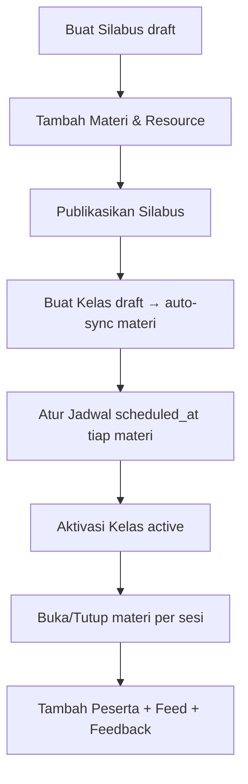

# Modul Classroom (Bootcamp)

Modul admin **Classroom / Bootcamp** untuk CodeIgniter 4 — mengelola silabus, materi, resource belajar, kelas, jadwal, peserta, pengumuman, feedback, moderasi karya member, dan pengaturan sertifikat.

Dibangun berdasarkan `SPEC-BOOTCAMP.md`. Semua data disimpan di tabel `cls_*`.

> Catatan: ini adalah **halaman admin** (`modules/Classroom/`). Halaman member (`/bootcamp`) berada di `app/Pages/bootcamp/` dan **belum termasuk** dalam modul ini.

---

## Struktur

```
modules/Classroom/
├── Config/
│   └── Routes.php              # Route grup {urlScope}/classroom
├── Controllers/
│   ├── Syllabus.php            # CRUD silabus + duplikasi (deep copy)
│   ├── Material.php            # CRUD materi + resource (konten JSON per tipe)
│   ├── ClassRoom.php           # CRUD kelas + pengaturan sertifikat
│   ├── Schedule.php            # Jadwal, detail, progres, kuis, submission, meeting, absensi
│   ├── Member.php              # Kelola peserta (tambah, import CSV, drop/restore)
│   ├── Feed.php                # Pengumuman kelas (pin/unpin)
│   ├── Feedback.php            # Review feedback peserta (read-only)
│   └── MemberWork.php          # Moderasi karya member + email saat approved
├── Models/                     # 16 model untuk tabel cls_*
├── Views/                      # UI admin (extend Heroicadmin layout)
└── Database/
    └── Migrations/             # 8 migrasi → 16 tabel cls_*
```

## Alur Aktivasi Kelas (Admin)



## Instalasi

1. Namespace `Classroom` sudah terdaftar di `app/Config/Autoload.php`.
2. Menu sidebar sudah ditambahkan di `modules/Heroicadmin/Config/Heroicadmin.php`.
3. Jalankan migrasi (hanya namespace ini, karena migrasi App lama ada yang bermasalah):

```bash
php spark migrate -n 'Classroom'
```

4. Akses panel: `/{urlScope}/classroom/syllabuses` (default `/ruangpanel/classroom/syllabuses`).

## Fitur Utama

| Area | Endpoint | Fungsi |
|------|----------|--------|
| Silabus | `/classroom/syllabuses` | CRUD, duplikasi (deep copy materi+resource), hanya published jika ≥1 materi |
| Materi | `/classroom/syllabuses/{id}/materials` | CRUD materi + resource 10 tipe, reorder |
| Kelas | `/classroom/classes` | CRUD, auto-generate `class_materials`, blok aktivasi jika belum sync/terjadwal |
| Jadwal | `/classroom/classes/{id}/schedule` | Sync materi, set jadwal, buka/tutup materi |
| Progres | `.../schedule/{cm}/progress` | % selesai resource wajib per peserta |
| Kuis | `.../schedule/{cm}/quiz-results` | Riwayat attempt kuis |
| Submission | `.../schedule/{cm}/submissions` | Review (accepted/revisi), skor 0-100, download file anti path traversal |
| Meeting | `.../schedule/{cm}/resource/{rid}` | Detail tatap muka + set absensi |
| Peserta | `/classroom/classes/{id}/members` | Tambah, import CSV, drop/restore |
| Feed | `/classroom/classes/{id}/feeds` | Pengumuman + pin |
| Feedback | `/classroom/classes/{id}/feedbacks` | Verifikasi syarat klaim sertifikat |
| Karya | `/classroom/memberworks` | Moderasi publish/reject + email notifikasi |

## Pengaturan Sertifikat (di form Kelas)

- **certificate_claimable** — gate utama: member boleh klaim sertifikat.
- **certificate_requirement** — checklist resource tipe `submission` yang wajib selesai (disimpan sebagai CSV ID resource).
- **required_feedback_before_claim_certificate** — wajib isi feedback sebelum klaim.

## Catatan Teknis

- Controller memakai method plain (`index`, `store`, `data`, ...) dengan route eksplisit (mengikuti pola modul `Course`, bukan `getX`/`postX`).
- `$this->db` harus dideklarasikan & diinisialisasi manual (`\Config\Database::connect()`) karena `AdminController`/`BaseController` tidak menyediakannya. Model `CodeIgniter\Model` sudah punya `$this->db`.
- Tabel user yang dipakai untuk peserta adalah `mein_users` (bukan `users`).
- `EmailSender` di `app/Libraries/EmailSender.php` memakai `setTemplate()` + `send()` (tidak ada `sendBySlug`).
- Fitur yang sengaja **belum** diimplementasikan (gap sesuai spec): engine scoring (`cls_member_scores`), pengerjaan kuis oleh member, notifikasi (`cls_notifications`) — tabel & model sudah ada, logika menunggu sisi member.
